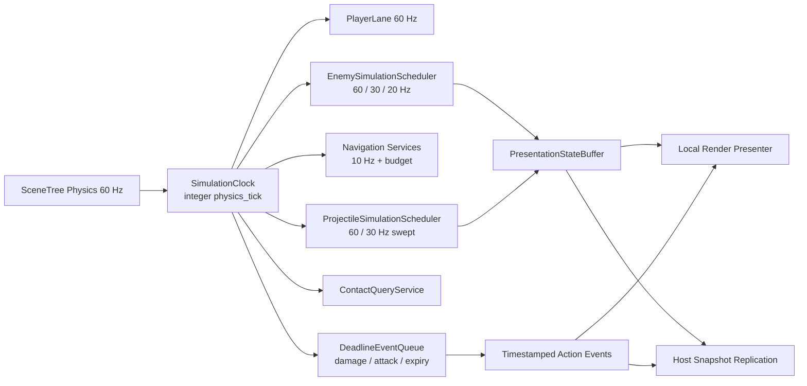
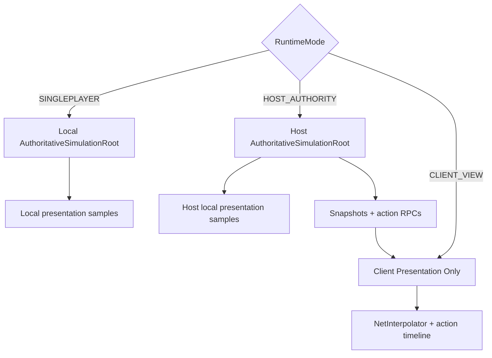

# 权威模拟 Tick 架构审计与迁移方案

> 状态：提案 / 架构审计记录（非性能回归基线）
> 日期：2026-07-21
> 范围：塔防压力场景、单机与多人 Host 的共享权威模拟、客户端表现层
> 本文记录证据、当前已落地的低风险切片与后续迁移设计；目标调度器尚未全部建成。

## 1. 结论

当前压力场景的主要问题不是“寻路完全没有降频”，而是**寻路已经做了 10 Hz 左右的错峰与预算控制，但敌人实体、移动/接触检查和大批弹体仍然以 60 Hz 执行**。这使脚本调用、`CharacterBody2D` 移动、`Area2D` 接触语义、世界碰撞射线和 Physics2D 活跃对象数在高密度场景中同时放大。

正确方向不是把整个项目的物理 Tick 粗暴降到 20 Hz，也不是只给动画补一个插值开关，而是建立统一的分层架构：

1. SceneTree / PhysicsServer 和本地玩家保持 60 Hz，保留输入、移动和镜头手感。
2. 单机与 Host 共用同一个权威模拟入口；客户端不运行敌人权威逻辑。
3. 敌人决策通常运行在 30 Hz，远距离且有安全移动凭证的敌人可以运行在 20 Hz，导航/LOS 保持约 10 Hz。
4. 敌人的视觉位置、动画和纯表现特效按渲染帧更新；逻辑通过状态样本和带 Tick 的动作事件驱动表现，而不是由动画帧反过来决定伤害或发射时机。
5. 普通弹体只有在具备扫掠碰撞等价性后才能从 60 Hz 降到 30 Hz；高速、复杂制导或尚未证明等价的弹体继续保持 60 Hz。
6. 接触伤害最终应从“每个敌人一个持续活跃的接触 Area”迁移到共享空间查询服务，但必须完整保留进入、离开、停步、植物移除和伤害冷却语义。
7. 多人继续采用服务器权威快照，不以跨平台确定性锁步为目标。稳定 Tick、稳定顺序和可注入随机种子用于回归与重放，不用于假定 Godot Physics2D 能逐位确定。

建议优先完成“基础原石虫 + Capoo AK + AK 子弹”的纵向切片。它直接覆盖本次 Profiler 中最重的敌人移动与约 800 发弹体压力，同时避免一次性重写全部敌人、Boss、植物和网络协议。

### 1.1 本轮已经落地的低风险切片

本文后续章节描述的是完整迁移目标；本轮没有宣称已经建成统一调度器。当前先完成了可以独立验证、且不改变玩家 60 Hz 的四项减压：

- 导航缓存的未到期判断移到性能包装与完整导航调用链之前；空接触/零冷却和零速度路径同样提前返回。
- AK、骑士与火焰远程原石虫只把“是否开始攻击”的感知错峰到 20 Hz；已承诺的起手、连发、动画事件、移动和伤害仍按 60 Hz 执行。
- AK/SMG 共用子弹的位置、寿命和 `Area2D` 接触仍按 60 Hz；仅把 World 射线改为错峰 30 Hz，并对两次检查之间的完整线段累计扫掠。接触伤害前会补验未检查线段，不能命中墙后目标。
- 伤害数字从空闲状态出现的首个数字立即重绘；持续新增的数字并入下一次 30 Hz 批量 TextLine 推进与重绘，最迟延后一档约 33 ms，不再因每帧新增数字退化回 60 Hz 全批重建。

本文现有精确 A/B 数字没有随文保存完整命令、对应代码 commit SHA 和受控原始 JSON，因此统一视为**探索性诊断记录**：可以用于定位热点和设计下一轮实验，不得作为收益承诺、发布判定或回归门槛。只有按 2.3 节补齐可审计产物后，数字才能升级为正式基线。

代码审核发现，早期 200 AK Headless 对照表不具备形成可审计性能结论的条件：导航与空接触快速返回被移到诊断计时器之前后，`navigation_calls` / `touch_damage_calls` 的含义从“包装入口次数”变为“实际慢路径次数”；同时旧样本 180 个渲染采样执行了 229 个物理 Tick，新样本只执行 180 Tick，未按权威 Tick 归一化。该组 Wall/Physics 数字还混入了仅在 `performance_metrics_enabled=true` 时存在的 `Time.get_ticks_usec()` 与 Dictionary 统计开销，不能外推生产模式。

因此这部分只能用功能断言和慢路径次数验证“工作确实被跳过”；发布验收必须重新执行 `metrics=false` 的同提交 A/B，并把无计时的语义入口计数与耗时采样分开。另有一组 300 AK 世界射线探索性记录：射线频率由 54,815 次/秒降至 26,826 次/秒，射线 CPU 由 351.8 ms/秒降至 148.1 ms/秒，Physics p95 由 72.393 ms 降至 41.764 ms；因缺少上述受控原始产物，这些精确数值只用于提出复测假设。极高压力截图中同一批处理系统在一帧调用 8 次，也与 Godot 默认每渲染帧最多追赶 8 个物理步一致；追帧债务必须单独记录，不能与单 Tick 成本混为一谈。

### 1.2 300 AK 极限复测与被否决的“参数优化”

把同一探针提高到 300 个同步进入交战状态的 AK 后，探索性结果仍未达到实时目标，并提示同步齐射、弹体节点/`Area2D` 数量、渲染子节点和池溢出可能共同放大对象压力；具体占比仍需受控复测确认。

为避免用纯正延迟改变平均首发时间，AK 现在使用 5 个零均值攻击相位 `[0, -1, +1, -2, +2]` Tick：每轮有效 windup 为 `W + δ`，后续 cooldown 为 `A - δ`，所以单体完整周期、长期 DPS、群体平均首发 Tick 与多人协议不变。工作记录称下面两次 300 AK 实时节奏探针使用相同代码、固定种子且只切换静态 A/B 开关，但缺少可核验的命令、commit SHA 与原始 JSON；表中数值仅保留为探索性诊断：

| 指标 | 同步控制组 | 5 相位错峰 | 变化 |
| --- | ---: | ---: | ---: |
| Wall p95 | 325.232 ms | 77.871 ms | -76.1% |
| Physics p95 | 43.956 ms | 27.805 ms | -36.7% |
| 多物理步渲染采样占比 | 50.42% | 19.58% | -61.2% |
| 240 个采样内物理 Tick | 651 | 348 | -46.5% |
| AK 子弹同时借出峰值 | 2338 | 1413 | -39.6% |
| 节点数 max | 20701 | 16076 | -22.3% |

这些探索性现象与非线性反馈假设一致：错峰没有删除任何设计射击，理论上只是把 300 个单位的单 Tick 首发峰从 100 压到 60，可能因此削弱“齐射扩池 → 慢帧 → 追赶更多 Tick → 同帧生成更多子弹”的正反馈；在可审计复跑前，不能确认因果关系或收益幅度。专项功能测试另行验证了两轮攻击不漂移、周期和总发射语义不变。

工作记录还包含一组 `--fixed-fps 60` 隔离 A/B：两组各执行 240 Tick，Wall p95 记为 44.672 / 45.446 ms，子弹峰值记为 757 / 750。这组未归档原始产物的数据提示错峰可能主要治理实时调度尖峰和追帧正反馈，而非降低单 Tick 成本；该解释仍需按 2.3 节复跑，不能直接当作结论。真正降低稳态每 Tick 成本仍需要后续弹体结构迁移。

针对截图中“同一渲染帧追赶 8 个物理 Tick”的现象，工作记录还记载了一次把未启用 5 相位错峰控制组的 `physics/common/max_physics_steps_per_frame` 从默认 8 限制为 3 的探索性对照：300 AK 探针 Wall p95 / max 记为 160.208 / 228.903 ms，执行 530 个物理 Tick，超过 33.33 ms 的渲染采样由 33.75% 上升到 63.33%。结果与“把集中卡顿摊成更长模拟减速、没有减少单 Tick 工作量”的风险一致，但精确幅度不可作为证据；该参数改动已撤销，也不得作为性能成果。

从机制上应把默认追帧作为遥测中的独立“时间债”报警，不能用更小的追帧上限掩盖架构问题。探索性错峰样本记录了 19.58% 的采样执行多个物理步、Wall p95 77.871 ms，并同时出现 1400 级子弹节点；这些数字用于支持继续调查逻辑弹体/视觉代理分离，而不是证明既定收益，也不能成为回归阈值。

### 1.3 为什么下一层不能只继续降频

频率是本次第一根杠杆，但 30 Hz 世界射线和齐射错峰生效后，AK 弹体的主要剩余成本已经变成**对象结构乘以活跃数量**。本轮已把通用子弹与 AK/SMG 子弹原先的“主体 + 发光覆盖 + 柔光晕”三层 CanvasItem 合并成共享单次绘制 Shader：每发 AK 子弹现在只包含 1 个 `Area2D` 根节点、1 个主体 `AnimatedSprite2D` 和 1 个 `CollisionShape2D`，即 3 个节点、1 个可视实例。按探索性样本中的 1413 发峰值计算，仍约有 4239 个弹体节点和 1413 个持续参与 Physics2D 的 Area；`CapooProjectileMotionSystem` 只是把独立回调集中成一个循环，并没有把这些对象变成连续数据。

一次 600 发可见弹体工作样本显示，共享单次绘制相对旧三层方案没有破坏批处理，记录的渲染对象 / draw call 从 2597 / 1258 降至 1397 / 58，Render CPU p95 从 5.112 ms 降至 2.628 ms。该样本同样没有按 2.3 节归档完整原始产物，所以只证明“旧三层节点是应移除的热点”并用于指导后续结构设计，不作为正式容量基线或收益承诺。

因此下一阶段应分成两步，并先保持玩法 60 Hz：

1. 用结构化连续数组保存弹体位置、上一位置、方向、速度、寿命、伤害、ID 和所有者，集中做 60 Hz 扫掠与命中排序；植物候选复用占地索引，玩家数量很少可直接遍历。旧 `Area2D` 路径先作为权威路径，新路径 shadow-run 记录逐 Tick 差异，结果一致后再切换。
2. 用 AK/SMG 各自的单通道 `MultiMeshInstance2D` 表现代理替代每发 1 个单次绘制主体；共享 Shader 继续在同一 draw 内保留清晰主体、自发光与克制柔光，并保留动画相位与夜间视觉。只有完成运动、薄墙、移动目标和同 Tick 事件等价测试后，才评估把普通弹体的权威推进从 60 Hz 降到 30 Hz。

世界碰撞“证书”目前不能直接默认开启。地图外还有商人、WorldBounds 等 layer 1 阻挡物；仅凭 TileMap 证明线段为空会导致穿透。安全方案必须把非 TileMap 阻挡物纳入小型补充注册表，未知 layer 1 物体 fail-closed 回退到精确射线，并覆盖商人启停、边界和未知动态阻挡物测试。

## 2. Profiler 与现有容量证据

### 2.1 本次压力截图

用户提供的 Profiler 样本显示了三档逐渐恶化的负载。Profiler 中父函数与子函数可能是包含关系，下面的时间不能简单相加，但热点排序和调用规模是明确的。

| 样本 | Script Functions | 主要热点 |
| --- | ---: | --- |
| 中等压力 | 约 12.01 ms | `YuanshiInsect._physics_process` 7.51 ms / 313 次；`CapooAK47._physics_process` 6.98 ms / 212 次；安全导航方向约 5.86 ms |
| 高压力 | 约 37.83 ms | `YuanshiInsect._physics_process` 31.75 ms；`Enemy._move_until_player_contact` 17.66 ms；安全导航方向 11.10 / 9.28 ms |
| 极高压力 | 约 55.81 ms | `CapooAK47._physics_process` 29.86 ms / 944 次；`YuanshiInsect._physics_process` 26.71 ms；移动接触 18.76 ms；弹体批处理 7.90 ms；792 次子弹推进 6.26 ms、世界命中判断 4.06 ms |

另一个样本中 Physics2D 自身约为 12.25 ms。它说明即使脚本降频，活跃 `CharacterBody2D` / `Area2D` / 碰撞对仍然需要单独治理，不能把所有收益都寄托在减少 GDScript 回调上。

### 2.2 仓库既有性能评估

`dev_tools/tower_defense_performance_assessment.md` 汇总了一组历史容量测量记录。由于当前没有与这些数字配套归档受控原始 JSON、完整命令和 commit SHA，它们同样只属于探索性参考，而不是可复现的回归基线：

- 300 活敌 + 96 防御塔综合交战的帧时间 p95 为 20.919 ms，物理阶段 p95 约 20.06–20.32 ms，碰撞对约 3311 / 3373（`dev_tools/tower_defense_performance_assessment.md:50-70`）。
- 正式第 12 波比例 + 300 活敌 + 96 塔四次复跑的 p95 约为 25.7–26.3 ms，GPU p95 约 3.09 ms；无塔控制组 p95 仍为 21.862 ms（同文件 `:315-351`）。该现象与 CPU / Physics2D 是主要容量压力的判断一致，但不足以单独证明归因。
- 300 个真实移动敌人的 Physics2D 隔离 A/B 中，完整模式 p95 为 11.117 ms；保留移动但关闭接触 Area 后为 9.712 ms，约回收 1.731 ms（同文件 `:258-271`）。接触 Area 是可观成本，但它承担真实玩法语义，不能直接关闭。
- AK 同类压力测试已有 841 发弹体峰值记录（同文件 `:146-168`），与本次约 792 次每帧弹体推进热点在方向上一致。

因此应把“正式第 12 波 + 300 活敌 + 96 塔”和“高密度 AK / 800 发左右在途弹体”都保留为回归场景；只测 300 个基础敌人会漏掉弹体和攻击状态机压力。

### 2.3 可审计证据规范

性能 A/B 只有同时保存以下产物，才能从“探索性诊断”升级为正式基线或回归门槛：

- 完整、可直接执行的命令行，包括场景、样本数、种子、构建模式和所有参数。
- 被测代码的 Git commit SHA；工作树非干净时还必须保存补丁及其 SHA256。
- Godot 精确版本，以及 renderer、rendering driver、操作系统、CPU、GPU、内存等环境信息。
- A/B 两侧全部功能开关和唯一预期变量；不得只记录“开启/关闭优化”而省略其他运行态开关。
- 每次运行未经手工摘录的完整 stdout/stderr 与原始 JSON；汇总表必须能追溯到对应原始文件。
- 原始输出、补丁和清单文件的 SHA256，并在清单中记录运行顺序、时间与重复次数。
- A/B 必须执行相同数量的权威物理 Tick；同时报告每渲染采样与每权威 Tick 的归一化结果，将追帧次数/时间债单列。Tick 数不同且无法严格归一化的样本必须作废。

缺少任一项时，精确数字只能用于热点定位和实验设计，不得写入发布判定、收益承诺或自动回归阈值。

## 3. 当前架构证据

### 3.1 全局仍应保留 60 Hz

- `project.godot` 的 `run/max_fps=60` 是渲染帧上限，不等同于物理 Tick；两项契约必须分别表达。
- `project.godot` 的 `[physics]` 段现已把 `common/physics_ticks_per_second=60` 写成显式项目契约；本轮没有降低玩家或 PhysicsServer 的全局频率。
- `scene/multiplayer/net_constants.gd:42-45` 已将 Host 物理、输入、玩家快照、敌人快照分别定义为 60、60、60、30 Hz。
- 塔防场景已打开 SceneTree 物理插值，并为权威玩家和敌人启用原生插值（`scene/game_tower_defense.gd:240-259`、`:638-653`、`:3556-3569`）。

Godot 官方文档也建议将物理模拟保持在固定 Tick，并用插值把渲染与物理解耦；降低全局物理 Tick 会增加玩家输入延迟。因此本方案不降低全局 60 Hz，而是在其内部对非玩家系统分频：

- [Physics interpolation introduction](https://docs.godotengine.org/en/stable/tutorials/physics/interpolation/physics_interpolation_introduction.html)
- [Using physics interpolation](https://docs.godotengine.org/en/stable/tutorials/physics/interpolation/using_physics_interpolation.html)
- [CPU optimization](https://docs.godotengine.org/en/stable/tutorials/performance/cpu_optimization.html)

### 3.2 导航已经降频，实体执行层没有

- `scene/enemy/enemy.gd:47` 把默认导航刷新间隔设为 6 个物理帧，即在 60 Hz 下约 10 Hz。
- `scene/enemy/enemy.gd:2571-2636` 负责相位错峰、刷新准入和静态远目标的进一步延迟。
- `scene/grid_pathfinder.gd:245-272` 已限制每帧路径查询、流场构建、敌人导航刷新、运行时扩展量和微秒预算；`scene/grid_pathfinder.gd:1538-1688` 与 `:2060-2095` 还有公平排队和运行时任务调度。
- 但 `scene/enemy/yuanshi_insect.gd:13-31`、`scene/enemy/capoo_ak47.gd:44-95`、`scene/enemy/capoo_knight.gd:44-75` 等仍为每个权威敌人保留独立 `_physics_process`。每次都进入触碰伤害、朝向、速度和 `_move_until_player_contact()`。
- `scene/enemy/enemy.gd:2748-2800` 的移动即使复用了导航方向，仍会每个实体每 Tick 执行直接位移或 `move_and_slide()`；`scene/enemy/enemy.gd:2955-2999` 的触碰伤害也仍从每个敌人的 Tick 入口被调用。

这解释了为什么继续只优化寻路不会解决截图中的根因：方向计算已降频，但“读取缓存方向后的移动、接触和通知”仍为 60 Hz × 实体数。

### 3.3 客户端表现层已经与权威敌人解耦

- `scene/game_runtime_base.gd:112-128` 已区分 `SINGLEPLAYER`、`HOST_AUTHORITY` 和 `CLIENT_VIEW`。
- `scene/enemy/enemy.gd:737-763` 将多人客户端敌人配置为代理，关闭自身物理/处理与原生物理插值；注释明确说明位置由网络快照在渲染更新中插值，避免双重插值。
- Host 在 `scene/multiplayer/mp_game.gd:2652-2681` 以玩家 60 Hz、敌人 30 Hz 的频率发快照；敌人达到 200 后降为 20 Hz（`scene/multiplayer/mp_game.gd:152-153`、`:2672-2679`）。
- 敌人快照按 46 个实体分块并做 cohort / delta 编码（`scene/multiplayer/mp_game.gd`），状态包含位置、速度、生命、生命修订号和视觉状态等（`scene/multiplayer/snapshot_manager.gd`）。
- 客户端在 `_process` 中插值远端玩家和敌人（`scene/multiplayer/mp_game.gd:3227-3273`）；离屏敌人进一步按 15 Hz 和 64 个相位桶更新（`:3276-3299`）。
- `scene/multiplayer/net_interpolator.gd:62-162` 已实现带渲染延迟的快照缓冲、插值与受限外推。
- 敌人攻击动作不依赖位置快照轮询，而由 Host 广播带时间戳动作，客户端把动作位置插入同一时间线后播放视觉事件（`scene/multiplayer/mp_game.gd:8115-8142`、`:9277-9359`）。

这部分是可复用的基础，不应改成另一套重复的同步系统。新的低频权威模拟只需要给现有快照与动作通道提供状态。

### 3.4 已有共享预算模式，但尚未统一成模拟时钟

仓库内已有多个正确的“注册到共享服务、空闲时停止、按数量/时间预算处理”范例：

- 状态过期：`scene/combat/status/status_effect_expiry_scheduler.gd:3-12`、`:82-145`，每渲染帧最多 128 个目标 / 1500 微秒。
- 燃烧：`scene/combat/status/burn_status_scheduler.gd:4` 的权威伤害周期为 1 秒；活跃时才打开物理处理，但调度器当前仍在每个物理 Tick 推进倒计时（`:177-225`）。
- 守护者光环：`scene/enemy/guardian_aura_system.gd:20-32` 以 0.2 秒刷新并限制目标数、守护者数和 2500 微秒服务预算。
- 竹加农炮战斗：`scene/plant_defense/bamboo_mortar_combat_system.gd:15-18`、`:223-245` 已集中索敌请求并实施每帧数量/时间预算。
- AK 子弹：`scene/enemy/capoo_projectile_motion_system.gd:23-63` 已关闭每颗注册子弹的独立物理回调，改由一个系统循环。

这些实现证明项目已经接受共享调度器模式。问题是各服务使用各自的 `_physics_process` / `_process` 和时间概念，AK 批处理虽然消除了 Node 回调开销，仍在 60 Hz 遍历全部子弹。

### 3.5 弹体热点并非只靠批处理就会消失

- `scene/enemy/capoo_projectile_motion_system.gd:63-89` 每个物理 Tick 遍历所有注册 AK 子弹。
- `scene/enemy/capoo_ak47_bullet.gd:192-234` 的每次推进还会执行世界碰撞凭证判断或物理射线。
- 当前 `world_collision_certificate_enabled` 默认是 `false`（`scene/enemy/capoo_ak47_bullet.gd:12`），所以大量在途子弹会稳定地产生射线压力。
- 对象池的 `retained_capacity=384` 只是回收后的保留上限，不是活跃上限；池耗尽后仍会创建溢出对象，归还时再丢弃。扩大容量只会用更高常驻内存换取下一轮较少实例化，不能消除峰值时的 Area、节点与渲染成本。
- 当前 `Performance.PHYSICS_2D_ACTIVE_OBJECTS` 探针在大量 Area 存在时仍可能报告 0，不能把它当作 Area 数量。后续基准必须直接记录逻辑弹体数、监控 Area 数、视觉实例数和主线程单核等价值；外部 CPU 百分比除以全部逻辑核心会掩盖主线程饱和。

不能简单地“每两帧跳过一次子弹更新”：降频后必须对旧位置到新位置做连续线段扫掠，并证明墙体、移动目标、擦边命中和同 Tick 多事件顺序与原语义一致。未经验证的高速/制导弹体继续 60 Hz。

### 3.6 逻辑与动画仍有反向耦合

部分权威事件由 `AnimatedSprite2D.frame_changed` 触发：

- 火焰远程原石虫在 `scene/enemy/yuanshi_insect_fire_ranged.gd:24-27` 连接动画信号，并在 `:199-219` 到达 `attack_fire_frame` 时真正生成弹体。
- 龙舌兰炮和竹加农炮也在动画帧回调中发射（`scene/plant_defense/agave_cannon.gd:142-170`、`scene/plant_defense/bamboo_mortar.gd:312-389`）。

如果先降动画帧率或把动画移出权威时间线，攻击节奏会变化。迁移原则必须反转依赖：**权威模拟在整数 Tick 上决定“何时发射/伤害”，动画只消费事件并展示对应帧**。植物不应被拉入第一批敌人迁移，先把此模式在基础原石虫和 AK 上验证。

## 4. 目标与非目标

### 4.1 目标

- 玩家输入、移动、冲刺、镜头和本地预测维持 60 Hz。
- 单机和 Host 使用完全相同的敌人、弹体、伤害、状态模拟路径。
- 客户端只消费快照和动作事件，按渲染帧展示，不重复运行权威 AI。
- 频率必须是 60 的整数分频（30、20、15、10、5、2、1 Hz），避免浮点累计和不均匀相位抖动。
- 用稳定实体 ID、稳定遍历顺序、整数 Tick 和显式累计 `delta` 保证测试可复现。
- 每个迁移阶段都有功能开关、独立基准和可回滚路径。

### 4.2 非目标

- 不把全局 PhysicsServer 改为 20 或 30 Hz。
- 不让相机是否可见单独决定权威敌人是否更新；离屏敌人仍可能攻击玩家、植物或参与路径堵塞。
- 不在第一阶段重写全部敌人、Boss、塔、状态系统和网络协议。
- 不以 peer-to-peer 确定性锁步为网络目标。
- 不把“迁移 Tick”和清理大型脚本重复代码混成同一个提交。
- 不通过无条件多线程解决问题；活动 SceneTree、Physics2D 查询和多种导航对象有线程安全边界，先降低工作量和集中调度。

## 5. 建议的分层频率

所有频率都由 60 Hz 整数 Tick 派生。每个低频系统收到的是自上次执行以来的累计固定时间，而不是当前单帧 `delta`。

| 领域 | 权威频率 | 表现频率 | 说明 |
| --- | ---: | ---: | --- |
| 本地玩家输入、移动、冲刺、相机 | 60 Hz | 渲染帧 | 不降频；多人本地预测也在此层 |
| Host 上的玩家权威验证/最终模拟 | 60 Hz | 不适用 | 现状仍接受客户端位置，后续可改为输入驱动 |
| 敌人攻击截止时间、即时受击、死亡 | 60 Hz 事件队列 | 渲染帧 | 事件到期当 Tick 必须执行，不受普通 AI 预算推迟 |
| 敌人普通决策/状态机 | 30 Hz | 渲染帧 | 基础目标；按稳定 ID 分成 2 个相位 |
| 远距离、无接触、路径安全的敌人决策 | 20 Hz | 渲染帧 | 按 3 个相位；必须支持立即升档 |
| 敌人移动/世界碰撞 | 过渡期 60/30 Hz 双轨 | 渲染帧 | 无凭证、临墙、攻击接触保持 60；安全直线路段可先试 30 |
| 导航方向、LOS、重寻路 | 10 Hz 左右 | 不适用 | 沿用现有 6 帧相位和预算，不重复设计 |
| 接触伤害 | 过渡期 60 Hz；目标 30 Hz 扫掠/共享查询 | 不适用 | 先保留语义，完成共享接触服务后再降 |
| 普通、可扫掠弹体 | 目标 30 Hz | 渲染帧 | 第一批只转换 AK 子弹 |
| 高速、复杂制导、未证明等价的弹体 | 60 Hz | 渲染帧 | 逐类通过扫掠回归后才能降频 |
| 光环/群体状态刷新 | 5–10 Hz 或截止时间队列 | 渲染帧 | 守护者当前已经是 5 Hz；伤害 Tick 不应因预算永久漂移 |
| 生产、研究、仓库计时 | 1–5 Hz 或截止时间队列 | UI 渲染帧 | 完成瞬间由事件执行，不必每帧轮询 |
| 动画、枪口热量、锁定线、发光、粒子 | 无权威逻辑 | 渲染帧/质量预算 | 只消费状态和动作事件 |
| 玩家网络快照 | 60 Hz | 渲染帧插值 | 沿用现状 |
| 敌人网络快照 | 30 Hz；200+ 时 20 Hz | 渲染帧插值；离屏 15 Hz | 沿用现状，并让快照频率独立于模拟频率 |

### 5.1 活跃等级而不是单一全局敌人频率

建议每个权威敌人有一个带滞回的活动等级：

| 等级 | 条件示例 | 逻辑/移动策略 |
| --- | --- | --- |
| `CRITICAL` | 正在接触玩家/植物、攻击窗口、临近墙体、缺少移动安全凭证 | 关键步骤 60 Hz |
| `ACTIVE` | 已索敌、在战斗相关距离、可见或即将进入攻击范围 | AI 30 Hz；经验证后移动 30 Hz |
| `BACKGROUND` | 远离交互、无接触、静态目标、直线路径凭证有效 | AI/移动 20 Hz |
| `DORMANT` | 死亡、对象池、明确暂停的玩法实体 | 事件驱动，不参加 Tick |

规则：

1. 升档立即发生，降档需要 0.5–1 秒滞回，避免边界来回抖动。
2. 相机可见性只能影响表现 LOD，不能单独让权威实体降档。
3. 受击、目标变化、路径凭证失效、进入接触候选范围时强制升至 `CRITICAL`。
4. 同一等级内部用 `simulation_id % phase_count` 稳定错峰；不得按数组当前下标分相位，因为删除/插入会引发同帧重排尖峰。
5. 时间预算只能推迟可延迟的维护任务；伤害、死亡、弹体命中和攻击截止事件不能被预算静默丢弃。

## 6. 目标运行时结构

新增节点应按项目约定直接落在 `.tscn` 场景结构中，不在脚本里临时拼装。建议由一个轻量的 `AuthoritativeSimulationRoot` 组合以下职责；名字是架构占位，不要求一次全部实现：

### 6.1 `SimulationClock`

- 只在 `_physics_process` 中把 `physics_tick` 增加 1。
- 使用整数模数判断 30 / 20 / 15 / 10 / 5 Hz 到期，避免多个浮点 `Timer` 长期漂移。
- 对每条 Lane 记录累计固定时间；例如 30 Hz 执行一次时传入 `2.0 / 60.0`。
- 维护最大补算步数和“时间债”指标，但不能为了追帧一次性把全部相位合并到同一渲染帧。
- 为回归暴露当前 Tick、各 Lane 调用数、延迟事件数、预算耗尽数和最大等待 Tick。

### 6.2 `EnemySimulationScheduler`

- 敌人只注册/注销一次；权威状态仍保留在具体敌人脚本，第一阶段不要造一个吞掉所有敌人逻辑的巨型管理器。
- 统一调用 `simulate_decision_tick(dt, tick)`、`simulate_motion_tick(dt, tick)` 和必要的即时事件入口。
- 按稳定 `simulation_id` 排序；多人可复用 `net_id`，单机需要由权威模拟分配同样稳定的 ID，不能用 `instance_id` 作为跨运行顺序。
- 迁移期允许未转换敌人继续使用原 `_physics_process`，但同一个实体绝不能同时走新旧两条权威路径。
- 调度器只在 `SINGLEPLAYER` 和 `HOST_AUTHORITY` 中启用；`CLIENT_VIEW` 不注册权威实体。

### 6.3 `ProjectileSimulationScheduler`

- 复用现有 AK 批处理注册模型，抽象成可声明 Tick 等级和扫掠能力的弹体接口。
- 30 Hz 弹体每次从 `previous_position` 扫掠到 `next_position`，按距离顺序处理最近命中。
- 同一 Tick 的世界、玩家/植物、爆炸事件要有明确优先级和稳定排序。
- 只有具备等价测试的弹体进入 30 Hz Lane；其他弹体仍走 60 Hz。
- 世界碰撞凭证只能在地图几何修订号一致、线段覆盖完整且动态阻挡规则明确时复用，不能只把当前静态布尔值打开。

### 6.4 `ContactQueryService`

- 目标是替代每敌人独立 `TouchDamageArea` 的持续物理开销，而不是删掉接触玩法。
- 复用现有玩家/植物空间索引，按敌人运动扫掠包围盒查询候选，再做精确形状/距离判断。
- 显式维护接触集合差分：`entered`、`staying`、`exited`。
- 保留停步、玩家/植物移除、无敌/阵营过滤、伤害冷却、同 Tick 多目标和敌人死亡时清理。
- 在转换完整前，`CRITICAL` 敌人继续使用旧 Area 路径；不能同时由 Area 和共享服务造成双伤害。

### 6.5 `PresentationStateBuffer`

权威碰撞根与视觉根应解耦：

- 权威层保存离散模拟样本：Tick、位置、速度、朝向、状态、动作事件。
- `VisualRoot` 在 `_process` 中按渲染时间读取两份样本并插值；传送、复活、纠错和对象池重用必须清空历史并立即 Snap。
- 枪口热量、法术发光、锁定线等纯表现量由 `AnimationPlayer`、Tween、shader 时间或表现脚本推进，不再占用权威 AI Tick。
- 攻击、受击、死亡等事件携带 `simulation_tick` / `action_id`，表现层可以晚到播放，但不能反向决定伤害是否发生。

需要特别注意：**保持全局物理 60 Hz、但只在每第 2/3 个物理帧修改一次敌人 Transform 时，Godot 原生物理插值本身不会自动产生均匀的 30/20 Hz 轨迹**；它仍会看到“一个物理帧不动、下一个物理帧跳动”的样本。这里必须使用跨低频逻辑样本的自定义 `VisualRoot` 插值，或保留一个极轻的 60 Hz 位置积分器。该判断是基于当前 60 Hz 外层与 Godot 插值工作方式作出的架构推论，需在纵向切片中用慢速录像验证。

## 7. 单机、Host 与客户端边界

### 7.1 共享权威模拟

| 能力 | 单机 | Host | Client View |
| --- | --- | --- | --- |
| 本地玩家 60 Hz | 是 | 是 | 是，预测路径 |
| 敌人 AI / 移动 /伤害 | 是 | 是 | 否 |
| 权威 RNG / 掉落 /生产 | 是 | 是 | 否 |
| 生成状态样本与动作事件 | 是 | 是 | 否 |
| 发送网络快照 | 否 | 是 | 否 |
| 消费网络快照 | 否 | 否 | 是 |
| 按渲染帧展示 | 是 | 是 | 是 |

单机和 Host 的差异只应位于输入/输出适配器：单机直接接收本地输入并把表现样本交给本地 Presenter；Host 还要接收网络输入并把同一权威状态交给快照编码器。敌人的决策、移动、伤害、随机和计时代码不应复制两份。

### 7.2 当前玩家权威边界的已知缺口

当前敌人和世界由 Host 权威模拟，但远端玩家并非完全由 Host 从输入重演：客户端 RPC 会上报位置和速度，Host 验证后接受并应用（`scene/multiplayer/mp_game.gd:3569-3658`、`:4132-4181`）。

长期可迁移为：客户端只发送输入命令；Host 以 60 Hz 模拟所有玩家；本地客户端继续预测并按权威快照重放/纠正。但这是网络安全与一致性项目，不是本次敌人 CPU 优化的前置条件。应放在独立阶段和协议版本中，避免把可快速验证的敌人降频拖入大规模网络重构。

## 8. 客户端插值与本地表现

### 8.1 保留现有网络插值

`NetInterpolator` 已按快照间隔设置渲染延迟：玩家默认 2.0 个快照间隔，敌人默认 2.5 个快照间隔；外推分别限制到 0.05 秒和 0.12 秒（`scene/multiplayer/net_constants.gd:56-61`）。敌人快照从 30 Hz 降为高压 20 Hz 时，客户端还会动态更新插值间隔（`scene/multiplayer/mp_game.gd:3433-3462`）。

这一机制应保留。网络快照频率和 Host 内部模拟频率必须是两个参数：例如敌人 AI 20 Hz 仍可按 30 Hz 发送由移动状态推导的快照，反之也不要求 30 Hz AI 每 Tick 必发包。

### 8.2 单机/Host 本地表现不能直接套网络延迟

本地 Presenter 可以复用“样本缓冲 + 插值”的数据结构和事件接口，但不应直接套用网络的 2.5 快照延迟：

- 客户端需要缓冲来吸收抖动和乱序。
- 单机/Host 没有网络抖动，可采用一个低频 Tick 的历史插值，或基于权威速度做受限外推，以降低敌人视觉延迟。
- 玩家永远走 60 Hz 本地路径，不进入低频敌人 Presenter。
- 受击闪白、命中数字和攻击预警需要使用同一表现时间轴，避免位置在过去而特效在现在。

### 8.3 必须解除动画驱动玩法

迁移后的攻击流程应为：

1. 权威状态机在 Tick `T` 决定开始攻击，并计算伤害/发射 Tick `T + N`。
2. 表现层立即播放起手动画。
3. 截止时间队列在 `T + N` 产生弹体或伤害，不读取当前动画帧。
4. Host 广播带 `T + N`、位置和 `action_id` 的动作事件。
5. 客户端将事件插入插值时间线，过晚事件按明确策略补播或快速追帧。

这样动画帧率、离屏动画 LOD 和网络快照频率都不会改变实际 DPS。

## 9. 确定性与服务器权威约束

### 9.1 当前不能做确定性锁步的证据

- 敌人在初始化时调用 `RandomNumberGenerator.randomize()`（`scene/enemy/enemy.gd:279-282`）。
- 部分攻击散布和塔空闲朝向也使用各自随机源，例如 `scene/enemy/capoo_smg.gd:211-224`、`scene/plant_defense/agave_cannon.gd:79`。
- 部分伤害来源 ID 使用 `Time.get_ticks_msec()`（`scene/enemy/enemy.gd:3051-3054`）。
- `CharacterBody2D` / Physics2D 的碰撞结果不应被假定为跨平台逐位一致。

因此网络目标应继续是**服务器权威 + 快照/动作复制 + 客户端插值/预测纠正**，而不是让每个客户端用相同输入自行算出完全一致的世界。

### 9.2 仍然应该提高可复现性

- 会话创建一个 `session_seed`。
- 每个实体使用 `session_seed + stable_simulation_id + rng_stream_id` 派生的独立随机流，避免调度顺序改变后全局随机序列串扰。
- 所有权威截止时间使用整数 `simulation_tick`，不把墙钟时间作为玩法顺序。
- 事件 ID 使用 `simulation_tick + stable_id + local_sequence`，不使用 `Time.get_ticks_msec()` 保证唯一。
- 调度器按稳定 ID 排序；相同 Tick 的伤害、死亡、掉落和生成定义稳定优先级。
- 自动化测试允许固定种子；正式游戏仍由 Host 生成种子并随初始状态复制。

这些措施用于回归、重放和排查，不改变“Host 是最终真相”的边界。

## 10. 分阶段迁移

每一阶段都应是独立提交，带默认可回滚开关；性能提交不要混入无关资源、UI 或大规模格式化。

### 阶段 0：固定基线与语义签名

工作：

- 扩展现有性能探针，固定正式第 12 波 + 300 敌人 + 96 塔场景。
- 新增高密度 AK 场景，稳定维持约 800 发在途弹体。
- 记录 p50 / p95 / p99：整帧、Script Functions、Physics2D、导航、敌人移动、接触、弹体推进和射线。
- 记录玩法签名：每类发射次数、命中次数、伤害总量、死亡 Tick、掉落、穿墙、接触进入/离开、最终位置和对象池借还。
- 固定种子，并同时保存真实非固定种子的稳定性样本。
- 按 2.3 节归档命令、代码 SHA、环境、开关、完整原始输出、SHA256 清单和物理 Tick 归一化结果。

验收：现有探针连续至少 3 次复跑的 p95 波动范围及全部可审计产物被记录；测试退出后没有残留 Godot 进程、对象池泄漏或未清空注册表。

### 阶段 1：引入模拟时钟与兼容模式

工作：

- 在场景中加入 `AuthoritativeSimulationRoot` / `SimulationClock` / `EnemySimulationScheduler`。
- 先以 60 Hz 兼容模式接管少量实体，行为和频率不变。
- 建立稳定 ID、注册/注销、对象池重用重置、指标和功能开关。
- 明确 `SINGLEPLAYER` / `HOST_AUTHORITY` 启用，`CLIENT_VIEW` 禁用。

验收：

- 同种子玩法签名完全一致。
- 迁移实体的新旧入口不会同时执行；注册数在生成、死亡、换图后归零。
- 兼容模式 p95 不得比阶段 0 冻结的可审计基线恶化超过 3%，且不能新增单帧相位尖峰。

### 阶段 2：基础原石虫 + Capoo AK 纵向切片

工作：

- 将两类敌人的普通决策迁到 30 Hz；导航保持当前 10 Hz。
- 首先只把有有效安全移动凭证、远离接触候选的直线路段降到 30 Hz；其余移动保留 60 Hz。
- 把 AK 枪口热量、朝向过渡等纯视觉状态移到 Presenter。
- 用动作截止 Tick 替代任何可能的动画帧玩法依赖。
- 增加立即升档和降档滞回。

验收：

- 目标类型的独立 `_physics_process` 权威调用被移除或禁用，30 Hz Lane 调用数精确等于设计值。
- 300 敌人场景中相关脚本热点时间至少下降 25%，总帧 p95 不回退；若未达到，先分析移动/Physics2D 占比，不继续铺开类型。
- 无穿墙、无漏接触、无双伤害；攻击次数和伤害总量完全一致，TTK 差异不超过一个低频 Tick。
- 视觉位置相对参考轨迹的 p99 误差不超过 1 个逻辑像素；60 fps 慢放没有稳定的“停一帧、跳一帧”。传送/复活不拖影。
- 单机与 Host 的玩法签名一致，客户端代理的快照/动作播放不回退。

### 阶段 3：AK 弹体数据化与表现批处理

工作：

- 先把现有 `CapooProjectileMotionSystem` 改为连续数据的 60 Hz 权威弹体内核，移除每发 `Area2D` 与热循环里的对象调用；旧路径 shadow-run、单写伤害。
- 使用原生 `Shape2D` 运动碰撞和共享候选索引，按沿线距离统一排序世界命中、目标命中、销毁与命中特效。
- 将现有单次绘制主体改为单通道 `MultiMeshInstance2D` 表现代理，共享 Shader 在同一通道内保留主体、自发光与柔光，并用前后样本插值；不让表现裁剪改变权威弹体。
- 为静态世界碰撞凭证增加补充阻挡物注册、地图修订号、未知 World 物体 fail-closed 与失效条件；没有证明前保持关闭。
- 60 Hz 新旧签名一致后，再以独立开关验证 30 Hz 全段扫掠；不能把“数据化”和“降频”同时切换后只看最终画面。

验收：

- 800 发在途弹体场景中不再存在 800 个弹体 Area / CollisionShape 节点；单次绘制视觉收敛为少量批次。
- 60 Hz 数据化路径的弹体系统脚本耗时至少下降 35%，节点数、CanvasItem 数和 Physics2D 注册量明显下降，且无新的集中批次尖峰。
- 可选 30 Hz 扫掠打开后，推进/查询次数再下降约 45–50%；未达到等价门槛时保留 60 Hz，不能为了指标放行。
- 静止目标、横穿目标、薄墙、高速、墙角擦边、同 Tick 多目标测试均无漏命中/穿墙。
- 发射、命中、伤害、销毁和对象池签名一致；长期运行没有注册表或池泄漏。

### 阶段 4：共享接触服务

工作：

- 以空间索引 + 运动扫掠重建玩家/植物接触候选。
- 双跑但单写：测试期可同时计算旧 Area 和新服务结果，只允许旧路径造成伤害，记录差异。
- 差异归零后逐类关闭旧 `TouchDamageArea` 监控。

验收：

- 进入、保持、离开、停步、植物移除、死亡清理和冷却语义在固定夹具中逐事件一致。
- 300 移动敌人 Physics2D p95 至少回收 1.0 ms；历史探索性 A/B 中约 1.7 ms 只用于估算潜力，不是验收上限，必须由受控复跑重新确认。
- 碰撞对和活跃监控 Area 明显下降；没有接触伤害漏算或重复。

### 阶段 5：按风险扩展敌人类型

建议顺序：

1. 基础 / 迅捷 / 硬壳等简单移动型。
2. AK / SMG 等明确冷却与弹体型。
3. 近战起手/收招型。
4. 普通远程状态机。
5. 自爆、光环、特殊控制型。
6. Boss 最后迁移。

火焰远程原石虫必须先解除 `attack_fire_frame` 对真正发射的控制，再进入低频 Lane。每批只转换一到两个行为族，并复用阶段 2 的全部语义与视觉门槛。

验收：正式第 12 波混合配置的每类玩法签名通过；相位桶最大单帧工作量不超过平均值的 1.5 倍；无类型退回逐实体 60 Hz 重逻辑。

### 阶段 6：网络玩家权威化（独立项目）

工作：客户端发送输入序列，Host 60 Hz 模拟远端玩家；客户端保留预测、输入历史和重放纠正；升级协议版本并保留调试可视化。

验收：模拟延迟、丢包、乱序下无速度作弊路径、无持续抖动，纠正距离和频率在门槛内。此阶段不作为敌人/弹体优化发布的前置条件。

### 阶段 7：清理重复与废弃接口

性能架构稳定后再进行：

- `scene/game.gd` 与 `scene/game_tower_defense.gd` 存在大量同名流程函数；审计时两者分别约 2688 / 5032 行，并有约 174 个共同函数名。应逐组件提取到 `CombatRuntimeBase` 或独立服务，而不是继续扩大两个脚本。
- `path_refresh_interval`、`direct_chase_extra_distance` 在多种敌人脚本与场景中保留导出项，例如 `scene/enemy/capoo_ak47.gd:16-18`、`scene/enemy/capoo_knight.gd:20-22`、`scene/enemy/capoo_ranged_enemy.gd:9-11`；当前搜索只发现声明/序列化，没有运行时读取。确认场景迁移与兼容后再删除。
- 开发探针和 `runtime_performance_telemetry.gd` 属于验证基础设施，不应当作“垃圾代码”随意删除。

验收：每次清理提交只做结构等价重构，固定种子签名和性能基准均不回退。

## 11. 总体验收指标

### 11.1 产品容量目标

在固定测试机和发布构建中，以“正式第 12 波比例 + 300 活敌 + 96 塔”为硬门槛：

- 目标：整帧 p95 不高于 16.67 ms，p99 不高于 20 ms。
- 阶段性最低要求：相对按 2.3 节重新采集并冻结的基线 p95 至少下降 30%，并且每个已迁移热点的调用频率符合设计；历史记录中的约 26 ms 只用于估算，不直接作为计算分母。
- GPU p95 继续单独记录，避免 CPU 改善后把灯光/粒子变成新的瓶颈。
- 约 80–120 ms 的稀疏外部尾帧单列诊断，不能用最大值掩盖稳定 p95，也不能因 p95 改善而忽略加载/驱动尾帧。

高密度 AK / 800 发弹体场景：

- Script Functions p95、弹体系统耗时和射线次数均至少下降 35%。
- 0 漏命中、0 穿墙、0 重复伤害、0 关键弹体丢弃、0 对象池/注册表泄漏。

### 11.2 玩法等价指标

- 固定种子下：生成数、攻击数、发射数、命中数、伤害总量、死亡数、掉落和结算一致。
- 低频离散化允许事件发生时间最多相差一个目标 Lane Tick，但不得累计漂移；周期攻击在长时间窗口内总次数必须一致。
- 接触集合 `entered/staying/exited` 逐事件一致。
- 世界碰撞、薄墙、角落滑动、移动目标横穿和传送单独覆盖。
- 单机和 Host 用相同输入脚本产生相同权威事件签名；客户端只验证表现时间线和最终收敛。

### 11.3 视觉指标

- 60 fps 录像逐帧检查，低频敌人不出现规律性停跳。
- 普通移动 Presenter 的位置误差 p99 不超过 1 个逻辑像素；急转弯允许短暂误差但不能穿墙显示。
- 攻击预警、枪口、弹体出生、命中特效与插值后位置在同一视觉时间轴。
- 离屏 LOD 返回屏幕时不快放整段旧动画；只恢复最新状态，必要动作按事件策略补播。

### 11.4 调度器健康指标

- 每 Lane：注册数、实际调用数、预算耗尽、最大等待 Tick、时间债、立即升档次数。
- 单帧相位工作量最大值不超过平均值 1.5 倍；若超过，检查 ID 分布和事件集中。
- 场景退出、波次结束和对象池回收后注册数归零。
- 调试版本可输出每实体最近模拟 Tick 和活动等级，发布版本关闭逐实体采样开销。

## 12. 风险与禁止事项

1. **禁止只改 `Engine.physics_ticks_per_second`。** 这会同时降低玩家和所有 Physics2D 语义频率，并放大输入延迟。
2. **禁止只跳过 `_physics_process` 而仍传单帧 `delta`。** 这会让速度、冷却和持续伤害直接减半/变慢；必须传累计固定时间或使用截止 Tick。
3. **禁止把动画帧继续当权威时钟。** 否则视觉降级会改变 DPS。
4. **禁止 30 Hz 弹体只做离散终点检测。** 必须扫掠整个运动线段。
5. **禁止以“离屏”作为唯一权威降档条件。** 离屏交战仍需正确模拟。
6. **禁止同一实体同时挂旧 `_physics_process` 和新调度器。** 必须有单一所有者与断言。
7. **禁止把可延迟预算用于丢弃伤害/死亡事件。** 预算适合导航、刷新和表现，不适合玩法事实。
8. **禁止把跨平台锁步当成降频的自然结果。** 固定 Tick 提高可测性，但 Physics2D 仍由 Host 裁决。
9. **禁止一开始迁移 Boss 和所有弹体。** 先用可控纵向切片验证结构和收益。
10. **禁止在性能提交中顺手删除大批“看起来没用”的代码。** 清理需独立证明等价，避免性能回归无法定位。

## 13. 预期收益排序

结合本次截图、代码结构和历史探索性 A/B，收益优先级应为：

1. 敌人实体决策与移动的分层调度：直接命中 `YuanshiInsect/CapooAK47._physics_process` 和 `_move_until_player_contact`。
2. AK/SMG 弹体的 60 Hz 连续数据内核 + 单通道 MultiMesh 表现：先消除上千 Area、碰撞节点与对象调用，再决定是否需要 30 Hz 权威推进。
3. 补充阻挡物注册 + fail-closed 世界证书：安全跳过明确为空的世界射线，未知对象继续精确查询。
4. 共享敌人接触服务：降低每敌人 Area，并复测历史探索性样本中约 1.7 ms 的潜在 Physics2D 接触成本。
5. 扩展到其他敌人族并解除动画驱动玩法。
6. 表现 LOD、灯光/粒子预算：用于 CPU 优化后出现的 GPU 次级瓶颈。
7. 大脚本去重和网络玩家完全权威化：重要但不应阻塞前述迁移。

这套顺序面向当前已观察到的热点，同时保留现有导航预算、网络快照插值和共享服务成果，避免用一次高风险重写替换已经成熟的部分。

## 14. 参考资料

- Godot 官方：[Physics interpolation introduction](https://docs.godotengine.org/en/stable/tutorials/physics/interpolation/physics_interpolation_introduction.html)
- Godot 官方：[Using physics interpolation](https://docs.godotengine.org/en/stable/tutorials/physics/interpolation/using_physics_interpolation.html)
- Godot 官方：[CPU optimization](https://docs.godotengine.org/en/stable/tutorials/performance/cpu_optimization.html)
- Godot 官方：[Optimization using Servers](https://docs.godotengine.org/en/stable/tutorials/performance/using_servers.html)
- Godot 官方：[MultiMesh](https://docs.godotengine.org/en/stable/classes/class_multimesh.html)
- Godot 官方：[Shape2D](https://docs.godotengine.org/en/stable/classes/class_shape2d.html)
- Godot 官方：[Engine（物理 Tick 与每渲染帧最大物理步数）](https://docs.godotengine.org/en/stable/classes/class_engine.html)
- Godot 官方：[Node](https://docs.godotengine.org/en/stable/classes/class_node.html)
- Godot 官方：[CollisionObject2D](https://docs.godotengine.org/en/stable/classes/class_collisionobject2d.html)
- 仓库基线：`dev_tools/tower_defense_performance_assessment.md`
