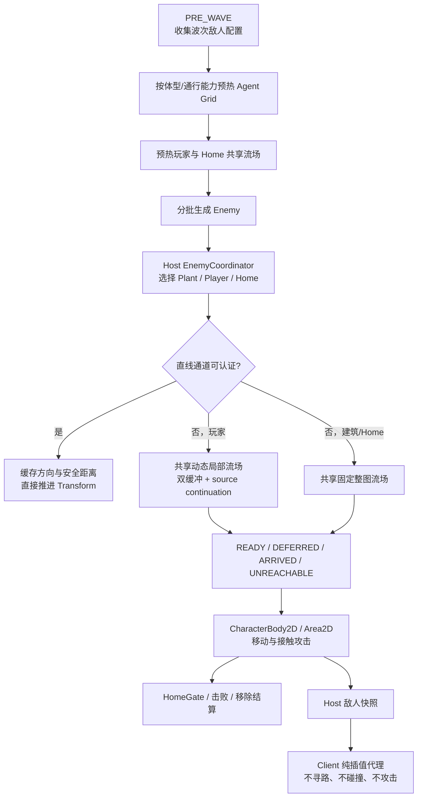

# 当前寻路机制深度审计与优化建议

- 审查日期：2026-08-23
- 审查基线：`8b1ac711b5c6e2cc1d99d669cf03d43929ca76bb`
- 审查范围：塔防、普通战斗与 Rogue 共用网格寻路；敌人目标选择、移动执行、碰撞接触、地形失效、波前预热、多人权威复制及现有性能探针
- 重点负载：正式首夜上限 200 敌人，以及 100 建筑 / 300 敌人的压力上界
- 审查方式：静态调用链与数据结构审计；现有 smoke test；300 敌人真实场景与 Physics2D 隔离探针

## 1. 结论摘要

当前实现不是“每只敌人独立跑 A*”，也不存在敌人之间互相避障造成的 O(E²) 路径计算。它是一套针对群体敌人优化过的自研混合系统：按真实碰撞体型生成可行走网格，固定目标共享反向完整流场，玩家目标共享局部动态流场，开阔地优先使用碰撞认证直线，所有冷建图工作再受统一的时间与扩展次数预算约束。

这套方向是正确的，不建议整体替换为逐敌 `NavigationAgent2D`。目前最重要的判断是：

1. **常驻主要瓶颈已不再是重复寻路。** 300 敌人下，寻路查询和流场构建已有缓存、错峰、分片及共享；更大的持续成本来自每个权威敌人 60Hz 执行状态机、移动 `CharacterBody2D`、更新 `Area2D` 接触对和提交 Transform。即使直线运动不调用 `move_and_slide()`，移动 Physics2D 对象本身仍有明显成本。
2. **100 建筑不会天然触发 100 倍寻路。** 建筑目标使用 48px 空间桶，建筑销毁使用反向目标索引；围栏及普通植物也不进入导航障碍拓扑。但在“建筑是主动目标、敌人与建筑之间存在墙/水、直线认证失败”的条件下，每个不同建筑目标和敌人体型可能建立一张整图静态流场。这是当前最清晰的建筑数量相关寻路风险。
3. **存在一个确定的正确性缺口：索敌不感知可达性。** 目标选择按几何最近选择植物、玩家或 Home；若最近目标与敌人不在同一可达分量，寻路稳定返回 `UNREACHABLE`，敌人停止，0.60 秒后仍可能重复选择同一目标，形成永久吸附。
4. **多人寻路权威边界正确。** 单机/房主执行目标选择、寻路、移动和攻击；客户端敌人关闭物理、处理、碰撞与攻击 Area，只插值权威快照，不会发生主客两端各算一份路径或路径分歧。另发现一个与寻路相邻但独立的高优先级问题：Boss 活跃期晚重连缺少 Boss 实体恢复，详见第 8 节。
5. **当前固定流场的“48 项上限”不是严格的内存上限。** 固定目标查询上下文会直接持有场的 `next_cells` / `distances` Dictionary；中央 LRU 淘汰后，仍被活敌上下文引用的完整场不会释放。大量不同建筑目标可能同时带来重建抖动与隐性驻留。
6. **最值得先做的路径优化**是“可达性标签 + 目标迟滞”“按来源需求扩展的局部静态流场”“发布态 packed 数组 + 中央句柄”；最值得解决总帧时间的中期方案是“远场幽灵移动 / 近场物理接触”的两级权威模拟，而不是继续压缩单次流场查询。

## 2. 当前完整运行链路



权威调用链：

```text
TowerDefenseCampaignCoordinator
  → TowerDefensePrewarmerCoordinator
  → TowerDefenseEnemyCoordinator.begin_wave_config()
  → Enemy.setup(config, player, GridPathfinder, runtime)
  → TowerDefenseEnemyCoordinator.assign_enemy_targets()
  → 各敌人家族 _physics_process()
  → Enemy._get_safe_navigation_move_direction()
  → 直线认证 / GridPathfinder 安全步进
  → Enemy._move_until_player_contact()
  → TouchDamageArea 或远程射程/LOS 攻击
```

主要实现位置：

- 场景装配：`scene/game_modes/tower_defense/tower_defense_game.tscn:370-372,391-392,485-533`
- 寻路核心：`scene/combat/navigation/grid_pathfinder.gd`
- 敌人共同消费层：`scene/enemy/enemy.gd:2967-3311,3722-4022`
- 基础近战循环：`scene/enemy/yuanshi_insect/yuanshi_insect.gd:13-35`
- 塔防索敌：`scene/game_modes/tower_defense/enemy/tower_defense_enemy_coordinator.gd:803-938`
- 建筑空间索引：`scene/game_modes/tower_defense/plant/runtime/plant_system.gd:655-735,1319-1387`
- 多人敌人代理：`scene/enemy/enemy.gd:940-966`、`scene/multiplayer/enemy/mp_enemy_coordinator.gd:363-422,485-616`
- 波前导航预热：`scene/game_modes/tower_defense/prewarm/tower_defense_prewarmer_coordinator.gd:342-519`

## 3. 网格、体型与路径算法

### 3.1 基础拓扑

`GridPathfinder` 使用 `AStarGrid2D` 表达地图格，但正式敌人热路径主要消费共享反向流场，而不是反复调用 A* 求完整路径。

- 八方向移动；正交代价 10、对角代价 14。
- Octile heuristic。
- `DIAGONAL_MODE_ONLY_IF_NO_OBSTACLES`，同时在流场扩展中显式禁止切墙角。
- 默认通行类型为 `LAND`；敌人配置可声明 Land/Water 组合。
- 按敌人碰撞 AABB 半尺寸和 `CharacterBody2D.safe_margin` 膨胀障碍，避免“格中心可走但真实身体卡墙”。
- 当前塔防实图探针区域为 74×46，共 3404 格。

建图位于 `grid_pathfinder.gd:400-479`。发布顺序是：增加 generation、失效旧任务和缓存、构造原始字节快照及障碍积分图、构造默认网格，最后一次性置 `is_built=true`。调用方只能看到完整旧代或完整新代，不会读到半成品。

体型缓存键由向上取整后的半尺寸和通行能力组成。移动目标还会把拓扑等价的体型合并为同一 cohort；本次实图探针预热得到 5 个 Agent Grid，而非按敌人数建立网格。

### 3.2 固定目标：共享完整反向流场

植物与 Home 调用 `grid_pathfinder.gd:2718-2873` 的固定目标安全步进。未命中时，以目标格为种子执行反向 Dijkstra，生成每个可达格的下一格和剩余距离：

- 构建：O(V+E)，当前格图上近似 O(地图格数)。
- 同一“目标格 + 体型 + 通行能力”的后续查询：平均 O(1)。
- 只接受完整路径，不接受 partial path；来源不在完整流场中即返回 `UNREACHABLE`。
- 中央 LRU 默认最多 48 个固定流场。

该设计对少量 Home 非常合适，对“8 格主动仇恨范围内的大量不同建筑目标”则可能过度：敌人距离目标很近，却仍可能因为一个局部墙角而创建覆盖整张地图的场。

### 3.3 移动玩家：共享局部动态流场

玩家目标使用 `grid_pathfinder.gd:2994-3581` 的动态槽：

- 槽键包含目标实例、体型拓扑、通行能力和接触半径。
- 默认以玩家为中心建立半径 16 格的局部场，最大 33×33=1089 格。
- 玩家移动至少 2 格或已发布锚点超过 0.25 秒时请求替换。
- 当前场与上一场双缓冲；替换未完成时，旧的完整安全路线仍可继续使用。
- 玩家周围不是单一目标格，而是一组满足“身体可站立、在接触包络内、与真实玩家位置同侧连通”的目标种子，避免薄墙另一侧的错误吸附。
- 若某个查询来源不在初始局部场内，任务记录 required source 并继续向外扩展；所有需要的来源被覆盖后即可提前发布，极端情况下才接近整图。

动态槽默认 TTL 15 秒、最多 64 个。塔防只在玩家 10 格内把玩家设为导航目标，所以普通场景通常能留在 16 格局部范围内；普通/Rogue 的全图追逐更可能触发向外 continuation。

### 3.4 直线认证与回退

`enemy.gd:2967-3135` 在请求流场前分四层判断：

1. 远距离固定目标（≥320px）：完整身体走廊认证成功则直走。
2. 近距离固定目标（≤128px）：开放区域证书或真实形状短扫成功则直走。
3. 附近移动玩家：只认证到下一次导航刷新前的短段；前方 3 格发现障碍时预取动态场。
4. 其他情况：查询共享流场。

大部分开阔区域判断通过体型障碍积分图 O(1) 完成。靠墙时才使用精确采样，且每可见帧最多 32 次 / 750µs。`DEFERRED` 不会盲走：只有上次方向仍通过 1px 真实身体探针时才沿用，否则停止等待。

### 3.5 分帧调度

运行时 Agent Grid 与流场统一在 `_process()` 中推进（`grid_pathfinder.gd:2060-2117`）：

- 每个可见帧最多 192 次扩展或 1000µs，先到者停止。
- 动态、静态、后台的服务循环为 6:1:1。
- 同优先级任务每 8 步轮换，防止单一大场独占。
- 搜索态使用 packed distance / next 数组和 15 个循环代价桶。
- 搜索完成后仍以 16 格一批物化为兼容 Dictionary，避免一次发布产生大尖峰。
- 每个可见帧最多接受 64 个敌人方向刷新；默认每敌 6 个物理帧更新一次方向，300 敌人正常约 50 次/帧。

这里按 **render/process frame** 限额非常重要：低帧率下多个 physics catch-up tick 仍共享一个上限，不会把六个相位突然合并为 300 次刷新尖峰。

## 4. 目标选择、建筑与碰撞语义

### 4.1 塔防目标优先级

`tower_defense_enemy_coordinator.gd:885-907` 的目标顺序为：

1. 8 个逻辑格内、允许主动攻击的最近建筑；
2. 10 格内最近存活玩家；
3. 最近 Home。

每 0.60 秒开始一轮敌人重选，每个物理帧最多处理 16 个。最近玩家为 O(P)，Home 是少量节点线性查找，建筑通过 48px 空间桶取局部候选后再做精确圆距离和水建筑资格检查。

水上建筑的攻击资格与水路通行是两套独立语义：基础近战敌人不允许主动选择水采集器，远程敌人可允许；这不等于让近战获得水上通行能力。现有放置/导航 smoke test 已覆盖该过滤边界。

### 4.2 建筑不是导航障碍

敌人本体 collision mask 为世界 + 水，不与植物实体层碰撞；`TouchDamageArea` 负责检测玩家和植物。因此：

- 普通植物与围栏不改变网格拓扑。
- 敌人沿地形路线前进，接触建筑后由 Area 停下并攻击。
- 放置/移除 1000 个真实围栏的专用测试验证 navigation generation、原始快照、体型网格和既有路线均不变化。

这是一项明确的性能/玩法契约，不是漏刷新。如果未来要求围栏组成迷宫或封死路线，需要新增动态占用层和“至少保留一条路线”的建造校验，不能简单在每次建筑变化时调用全图 `rebuild()`。

### 4.3 建筑数量的实际复杂度

设 E 为敌人数、B 为主动建筑数、K 为查询半径内候选数、M 为地图格数、U 为实际触发绕障的唯一“建筑目标 × 体型”组合数：

| 子系统 | 当前复杂度 | 100 建筑影响 |
|---|---:|---|
| 敌人 60Hz 状态/移动 | O(E) / tick | 建筑不直接放大；接触对增多时局部成本增加 |
| 导航方向刷新 | 约 O(E/6) / tick | 多数直线查询为 O(1) |
| 建筑索敌 | O(E·K/0.60s)，每 tick 最多 16 敌人 | 最坏密集布局 K≈B；不是每帧 E×B，但会形成周期性候选扫描 |
| 建筑销毁目标清理 | O(指向该建筑的敌人数) | 已由反向索引消除 E×B 全扫 |
| 固定建筑流场冷建 | O(U·M) | 隔墙/水边且目标分散时是主要条件性风险 |
| Physics2D 接触 | O(E + 实际局部重叠对) | 密集建筑边界会增加 Area pair、进入/退出事件和缓存失效 |

正式首夜 `wave_01.tres` 的 `max_alive_enemies` 为 200，即最多约 12,000 次敌人运动入口/秒；300 敌人压力上界约 18,000 次/秒。索敌的 16 个/帧批次在 200 敌人时表现为约 13 个忙 tick 后空闲，在 300 敌人时约 19 个忙 tick 后空闲，具有可见的周期性锯齿结构。

## 5. 地形失效与预热

`grid_pathfinder.gd:495-531` 只有 Land/Water 通行类别改变才增加 generation、立即停止读旧证书并延迟重建；草地、土地、金属等同属 Land 的变化不会触发导航重建。同一轮多个水陆格变化会被 `call_deferred()` 合并，但跨帧编辑仍可能重复发生整图重建。

当前重建会同步：

- 重采整个原始导航快照和障碍积分图；
- 清空所有体型网格、固定场、恢复路线和动态槽；
- 取消所有运行时任务；
- 先只发布默认体型，其余活跃体型随后再按预算重建。

因此，**普通首夜若没有运行期水陆转换，不应把周期卡顿归因于导航重建**。应先记录 `navigation_generation` 每秒变化和重建耗时。如果未来正式玩法允许频繁填海/挖水，再考虑脏区或分块 generation；当前直接实施增量拓扑的风险高于收益。

波前预热会扫描波次敌人配置，按场景/体型/通行能力去重，分阶段构建 Agent Grid，并预热玩家及全部 Home 目标流场。玩家完整场可被动态槽作为首次桥接场采用，随后被局部多源场替换。需要注意：

- 若玩家过快开波而异步预热未完成，战役协调器存在同步补齐路径，可能产生开波尖峰。
- 预热按 `scene_key` 先去重；若未来同一场景资源被两个不同通行配置复用，第二套 profile 可能被漏掉。
- Boss、召唤物或运行时变体若不在波次配置集合中，可能首次出现时冷建 profile；应通过活跃 profile 清单与预热命中遥测确认，而不是增加宽泛兜底。

## 6. 多人模式

多人采用 Host authority：

- 房主执行生成、目标选择、流场查询、移动、攻击与死亡结算。
- 客户端生成敌人后立刻调用 `configure_multiplayer_proxy()`，清除 `target_player`、`objective_target` 和 `pathfinder`，关闭 `_physics_process`、`_process`、collision mask 和子 Area。
- 客户端只插值房主快照中的位置、速度、动画和战斗状态。
- 敌人数 ≥200 时，房主敌人快照频率降为 20Hz；每个快照 chunk 最多 46 个实体。

所以“多人是否漏算路径/强化路径状态”不是本寻路机制的复制模型：路径本身根本不复制，也不应复制；客户端只需要收到最终权威运动状态。多人性能压力集中在房主，客户端的路径 CPU 基本为零。

客户端仍会随场景构建基础 `GridPathfinder`，因为其他本地系统可能使用地形查询；不能仅凭敌人代理不寻路就直接删除该节点。若要延迟客户端体型预热，应先列清项目内所有非敌人消费者。

## 7. 实测与现有测试结论

本轮使用 Godot 4.6.3 headless 对当前基线执行了针对性测试。headless 没有真实 GPU/render 时序，因此总帧数值只用于因果定位；发布门槛应在真实窗口、固定硬件和相同种子下复测。

### 7.1 通过的正确性/算法用例

| 用例 | 结果 | 关键覆盖 |
|---|---|---|
| `grid_pathfinder_dynamic_target_flow_smoke_test.gd` | 通过 | 300 contexts；动态场 86 个构建帧完成；断连来源稳定 `UNREACHABLE`；优先级选择器耗时为旧全扫描约 2.1% |
| `yuanshi_insect_navigation_smoke_test.gd` | 通过 | 敌人消费 READY/DEFERRED/UNREACHABLE 等状态及安全停止 |
| `plant_placement_navigation_filter_smoke_test.gd` | 通过 | 建筑放置、水陆资格与导航过滤 |
| `simple_fence_navigation_isolation_smoke_test.gd` | 通过 | 1000 围栏不污染导航 generation、缓存或 300 条路径 |
| `grid_pathfinder_home_flow_performance_benchmark.gd` | 通过 | 300 查询/tick，81,000 次 READY，无 DEFERRED/UNREACHABLE |

`home_flow` 基准约 7.51µs/查询、2.25ms/300 查询 tick。该用例包含较多恢复起点，是查询上界样本，不代表正式场每帧一定调用 300 次；正式敌人已有 6 帧方向缓存。

### 7.2 300 敌人热点探针

`tower_defense_enemy_cohort_performance_probe.gd` 的 180 个采样帧中，平均约 295.5 个活跃移动敌人：

- 导航：7930 次，合计 319.886ms，约 1.777ms/采样帧；最大刷新等待 1 个可见帧，64 上限只饱和 2 帧。
- 障碍前瞻：约 0.057ms/采样帧。
- `test_move`：约 0.207ms/采样帧。
- `move_and_slide`：约 0.530ms/采样帧。
- 认证直线位移：38,035 次，约 211 次/采样帧。
- runtime flow build peak 约 1.08ms，符合 1ms 预算允许的小幅批次越界。

这说明共享寻路热段已经有界；认证直线显著减少了 `move_and_slide()` 调用，但没有让 Physics2D 的移动对象更新消失。

`game_tower_defense_live_enemy_movement_performance_probe.gd` 的 headless 诊断中：

- 静态目标移动的 Physics p95 约 8.53ms。
- 移动玩家目标的 Physics p95 约 12.29ms。
- 禁止大群导航/运动后 Physics p95 约 6.15ms。

`physics2d_isolation_ab_probe.gd` 显示：即使使用已认证直接位移，完整移动群的 Physics2D p95 仍与基线接近；关闭脚本后中位数大幅下降。该探针在 headless 下未满足其完整 cohort 接受条件，因此不能作为发布门槛，但足以否定“只要绕过 `move_and_slide()` 就能解决主要卡顿”的假设。

上述部分压力用例退出时出现既有 ObjectDB / RID / resource leak 警告。它们发生在测试场销毁阶段，与本轮路径断言分开；应单独完善 fixture 清理，不能用其掩盖或否定寻路结果。

## 8. 已确认缺口与风险分级

### 高：索敌不感知可达性

证据链：

- Coordinator 只按几何距离选 Plant / Player / Home。
- `GridPathfinder` 在断连来源上正确返回 `UNREACHABLE`。
- Enemy 消费 `UNREACHABLE` 时缓存零方向，没有向索敌层反馈。
- 下一轮 0.60 秒重选仍可能得到同一几何最近目标。

表现可能是：隔水的非水目标、封闭分区内玩家、或没有同侧接触格的目标持续吸住敌人。正确修复应在目标层引入 profile 可达性，而不是让寻路返回危险 partial path。

### 高（条件性性能）：大量静态建筑目标生成整图场

开放地不会触发；一旦 100 个不同建筑分别需要绕障，最坏构建量约 O(U×3404)，并受 6:1:1 调度中静态目标只有 1/8 服务片影响。超过 48 个键会发生 LRU 抖动。主动植物本来只在 8 格内被选择，整图场明显超出通常需求。

### 中高：固定流场驻留没有真实硬上限

中央 LRU 限制的是索引条目，不是所有活引用。静态 `FlowQueryContext` 保存 `path_grid`、`next_cells` 和 `distances`；淘汰的 Dictionary 可能继续由敌人持有。当前也没有 resident cells/bytes、eviction 后存活引用和按目标/体型驻留量遥测。

### 中：重选目标形成周期性锯齿且缺少迟滞

200 敌人约连续忙 13 tick，300 敌人约忙 19 tick，之后等待下一周期。敌人位于两个目标的 Voronoi 边界时还可能每 0.60 秒翻转目标，反复失效导航 Context。使用可变 child index 作为 sweep 游标时，扫描期间的增删也可能短暂跳过或重复某个敌人，虽然下一轮会补偿。

### 中：没有基于实际位移的无进展看门狗

当前恢复机制关注导航状态、定时刷新和方向安全性，但 `move_and_slide()` 的实际位移没有进入重路由状态机。普通植物不阻挡 Enemy Body，因此常规建筑并不会触发；不过非网格动态碰撞体、极端墙角或未来新增阻挡实体可能让敌人无限重试同一目标/方向。看门狗必须排除 windup、攻击、有效接触、死亡和脚本化技能移动，避免把正常停步误判为卡死。

### 中：运行时水陆变化全局失效

单次水陆变化会清空所有 profile/field/slot 并同步重建基础图；之后不同体型按需恢复。正式首夜通常不触发，属于功能扩展风险，而不是当前卡顿的首要解释。

### 中：直接运动证书只绑定导航 generation

当前证书对 TileMap 水陆变化会正确失效，但如果未来在 World 碰撞层动态加入不经过 `DualGridTilemap.terrain_changed` 的 `StaticBody2D`，已缓存直线证书不知道拓扑已变。需要明确“任何导航相关 World 障碍变更必须增加 topology revision”的契约。

### 中（多人相邻问题）：Boss 活跃期晚重连缺实体恢复

该问题不是路径算法错误，但会表现为客户端缺少正在寻路的 Boss：

- `mp_enemy_coordinator.gd:666-703` 的普通敌人 live roster 排除 `LinglanBoss`。
- `mp_session_coordinator.gd:379-458` 的定向重连修复只发送普通敌人 roster/flow/manifest。
- Boss 专用 `boss_started` 只在开战时广播，并仅短时重播。

晚于重播窗口进入的客户端可能进入 `BOSS_ACTIVE` 却没有 Boss 节点，后续快照也无实体可应用。应为 Boss 提供可重复请求的权威 live state，而不是把 Boss 混回普通敌人路径 roster。

### 低至中：超大规模下刷新债务可能持续

300 敌人、6 帧刷新时理论约 50 次/帧，低于 64，实测最大等待 1 帧。若敌人达到 384+、多个家族降低刷新间隔，或低帧率追帧，固定 64 可能形成持续债务。此时应按时间预算和服务等级自适应，不能只把数值调大。

### 低：水建筑资格可被未来调用方绕过

正式生产调用都通过 `Enemy.set_objective_target()`，会执行水上建筑资格校验；但公开 `objective_target` 属性的 setter 本身只发信号。当前没有发现生产违规调用，仍建议改为私有 backing field 或把校验收束到唯一 setter，避免未来直接赋值绕过近战不可主动选择水建筑的规则。

### 维护风险：单文件职责过重

`grid_pathfinder.gd` 已同时负责拓扑快照、profile 膨胀、积分认证、固定/动态流场、任务调度、恢复路线、缓存、转换与遥测。建议先做不改变行为的数据结构拆分，再做算法升级，以降低回归面。

## 9. 推荐的新方案

### P0：先补齐可观测性与可复现实验

在改算法前扩展现有 cohort probe，增加三组 100 个真实主动建筑布局：

1. 开放分散：验证建筑数本身不会造出额外流场。
2. 密集接触：放大空间桶候选与 Area pair。
3. 隔墙/水边：稳定触发不同静态目标绕障场。

新增逐帧指标：

- `navigation_generation` 变化次数与重建微秒数。
- 固定场 hit/miss/build/eviction、每场覆盖格数、按目标/体型数量。
- 中央缓存项数与所有活句柄的 resident cells/bytes。
- runtime job 按优先级的 queue depth、age p50/p95/max、完成与取消数。
- `DEFERRED` 连续时长、`UNREACHABLE` 次数及目标类别。
- refresh debt、最大等待、每帧准入数。
- 索敌候选访问数、当前目标保持/切换原因。
- Area pair、进入/退出事件、重叠集合长度。
- verified-direct、`test_move`、`move_and_slide` 和直接 Transform 次数。

不要先降低 64 次刷新或 1ms 建图预算。减少预算只会把 CPU 时间转换成停步和尾延迟，不能消除总工作量。

### P1：profile 连通分量 + 可达目标选择 + 迟滞

在每个 Agent Grid 完成时，顺带生成 dense `PackedInt32Array component_id_by_cell`。每个可走分量获得稳定 ID。查询目标时：

1. 取得敌人来源分量。
2. 对建筑/玩家候选生成接触包络格。
3. 只保留至少一个接触格与来源同分量的候选。
4. 当前目标仍存活、可攻击、可达且没有明显更优目标时继续保持。
5. 只有新目标评分优于当前目标一定阈值，或当前目标死亡/不可达，才切换。

建议评分由“目标优先级、路径近似距离、当前目标迟滞、稳定 net_id tie-break”组成。固定目标可直接使用已发布流场 distance；冷场时先用同分量 + octile 近似，不能为每个候选同步建图。

额外增加 progress watchdog：若连续若干导航周期位移显著低于期望、又没有有效战斗接触，则失效当前 Context、把“目标 + profile + topology revision”短时记为不可达并立即重选。该机制是异常恢复，不应替代连通分量的主判定。

### P1：按来源需求扩展的局部静态流场

把动态槽已经验证的 bounded + required-source 思路推广到主动建筑目标：

- Home 继续使用完整预热场，因为所有敌人最终都可能需要它。
- 主动建筑默认以目标接触格为多源种子，只构建半径 12–16 格的局部场。
- 同一“目标 + profile”在同一时刻只有一个任务。
- 查询来源在局部场外时，把来源登记到 required-source 集合并继续向外 Dijkstra。
- 所有当前 required sources 被覆盖后，原子发布；后来的更远来源再继续或建立下一 revision。
- 保留完整路径契约，绝不发布未连到目标的 partial route。

建筑主动范围只有 8 格，常见场可从 3404 格降到最多 25×25 或 33×33。算法仍使用相同代价和防切角规则，不改变目标、接触和伤害语义。

### P1：把周期重选改为持续均匀轮转

保留 0.60 秒作为每个敌人的目标有效期，但不要一次启动 16×N 个连续忙 tick：

- 每个 physics tick 根据 `alive_count / (0.60×physics_hz)` 发放 token。
- 200 敌人平均处理 5–6 个/tick，300 敌人 8–9 个/tick。
- 16 仍作为追赶和紧急事件的硬上限。
- 使用稳定敌人 registry/net_id 队列，不以会变化的 child index 为长期游标。
- 目标死亡、玩家死亡、建筑进入/退出仇恨范围等事件可进入紧急队列；普通有效性检查走慢速轮转。

这样能削平候选扫描和导航 Context 失效波峰，同时维持相同平均重选时效。

### P1/P2：发布态改为 dense packed field + 中央句柄

搜索过程已经是 packed，当前最后再物化成 Dictionary 主要为兼容旧接口。新发布结构建议包含：

```text
FlowFieldHandle
  key / revision / topology_generation
  region / width / height
  PackedInt32Array next_index
  PackedInt32Array distance
  resident_cell_count / last_used_frame
```

敌人 Context 只保存 handle key/revision，不直接持有两个大 Dictionary；每次查询从中央存储重新取得有效句柄。中央存储按 resident cells/bytes 而不是场数量做硬上限，只有显式 pin 的活跃场可延后淘汰。旧 Dictionary API 只保留给诊断适配器，并统计调用，最终移除。

收益包括：O(1) 数组索引代替 Variant Dictionary 哈希、取消 16 格分批物化、减少内存碎片、让 LRU 变成真实上限，也为 component label 共用相同 cell index 打基础。

### P2：两级权威敌人模拟

这是降低总 Physics2D 帧耗的主要中期工程：

```text
GRID_GHOST（远场/开阔/有完整证书）
  → 中央 scheduler 批量推进，低频决策或 30Hz 运动
  → 关闭或休眠 Body/Touch Area
  → 用空间索引 + swept activation horizon 预测接触

PHYSICAL_CONTACT（靠近墙、玩家、建筑或技能交互）
  → 恢复 CharacterBody2D / Area2D / 60Hz
  → 使用真实形状扫掠、接触进入/保持/退出和伤害节拍

COMBAT / IMMOBILE
  → 只执行攻击状态与必要动画，不重复寻路
```

转换必须由房主权威执行，并保持以下不变量：

- 接近障碍、玩家或建筑前提前升回物理态，不能穿过接触包络。
- 水陆、碰撞体型、冲刺/传送/Boss 特殊运动仍走各自安全规则。
- Area enter/stay/exit、停步、拆除、死亡和伤害 tick 在 shadow-run 中逐事件一致后，才能真正关闭旧 Area。
- 客户端继续维持纯快照代理，不新增客户端模拟。

可先只让“普通敌人 + 远离所有接触候选 + 有 generation 绑定完整直线证书”的 cohort 进入 30Hz ghost，逐步扩大覆盖。300 敌人的运动入口理论上可由 18,000 次/秒降到接近 9,000 次/秒，收益远高于再微调一次 Dictionary 查询。

### P2/P3：仅在遥测证明后做增量地形拓扑

如果正式玩法确实出现持续水陆编辑，再引入：

- 固定尺寸 topology chunks 和每块 revision。
- 原始字节快照及积分图的 copy-on-write 脏区更新。
- profile 只重新膨胀受影响块和安全边界。
- 只失效穿过脏块的 field/component，而非清空所有缓存。
- 活跃 profile registry 在新 generation 后按实际引用优先重建。

这是高复杂度设计。若首夜 `generation/sec = 0`，当前阶段不应实施。

### P3：职责拆分

保持外部 facade 不变，将单文件逐步拆成：

- `NavigationTopologySnapshot`：原始地形、体型 profile、积分图、component。
- `FlowFieldStore`：packed 发布场、句柄、驻留预算。
- `FlowBuildScheduler`：优先级、时间片、required source。
- `DynamicTargetFlowService`：动态槽与双缓冲。
- `NavigationQueryFacade`：公开安全步进与旧 API 适配。
- `NavigationTelemetry`：指标和采样导出。

先机械迁移并跑现有契约测试，再改变算法，避免在 4700+ 行单体文件内同时重构行为和存储。

## 10. 不建议的方案

- **不建议每敌改用独立 A* 或 `NavigationAgent2D`。** 这会丢失共享目标的摊销，也不能消除每敌 60Hz Physics2D 更新。
- **不建议启用敌人互相避障。** 当前敌人层互不碰撞，正是避免群体 O(E²)/拥堵震荡的重要契约；除非玩法明确需要排队和绕行。
- **不建议让围栏直接触发全图重建。** 若围栏要封路，应设计动态占用层、局部失效和建造可达性校验。
- **不建议用 partial path 掩盖不可达目标。** 正确层级是索敌过滤与重选；错误 partial route 会把敌群带到墙边反复卡死。
- **不建议只调高/调低预算数字。** 当前 1ms/64 次预算实测基本守住；调参不能消除静态整图场、内存驻留和 Physics2D 持续底座。
- **不建议无条件做增量地形重建。** 草/土变化已经不会触发；先以 generation 遥测证明水陆更新是热点。

## 11. 分阶段实施顺序与验收标准

### 阶段 A：遥测与基准

- 固定相同地图、权威 tick、随机种子与硬件。
- 正式首夜 200 敌人和压力 300 敌人各测开放、密集接触、隔墙/水边三布局，每组至少 3 次。
- 保存命令、Git SHA、原始 JSON，而不是只保留终端摘要。

验收：正常 300 敌人导航刷新约 50 且 ≤64；refresh max wait ≤1 可见帧；runtime navigation p95 ≤1ms、peak ≤3ms；无水陆变化的首夜 generation 变化为 0。

### 阶段 B：正确性与静态流场

- component-aware 索敌和目标迟滞。
- 主动建筑 bounded static flow；Home 保持完整场。
- 连续 token 重选调度和稳定敌人 registry。
- packed 发布场及句柄可以先 shadow-read 对比 Dictionary。

验收：

- 断连最近目标会选择下一可达目标；无可达目标时行为明确且可恢复。
- 同目标/profile 同时最多一个 build job。
- 常见主动建筑目标 95% 在 ≤1089 格覆盖所有请求来源。
- 0 个错误 `UNREACHABLE`，0 个超过一个导航采样周期的无故停步。
- 200 敌人重选平均 5–6/tick，300 敌人 8–9/tick；紧急事件仍 ≤16。
- 目标序列、等距稳定 tie-break、最终伤害与旧规则一致。
- LRU 淘汰后 resident bytes 仍严格受中央预算约束。

### 阶段 C：权威模拟降频/批处理

- 先 shadow-run 接触服务，不关闭旧 Area。
- 逐步启用远场 ghost，近场提前恢复 60Hz 物理。
- 对多人 Host 和 Client proxy 分别记录，禁止客户端重新模拟。

验收：接触进入/保持/离开、停步、建筑拆除、敌人死亡、伤害 tick 逐事件一致；玩法签名一致；Client view 保持 0 寻路/0敌人物理；脚本热点至少下降 25%，Physics p95 至少回收 1ms，总帧 p95 不回退。

### 阶段 D：条件性拓扑增量化

只有实际记录显示 `navigation_generation` 在正式战斗频繁增长时启动。验收除性能外，还必须覆盖跨块对角、不同体型膨胀边缘、Land/Water 切换、旧证书立即失效和多人权威一致性。

## 12. 建议新增的自动化测试

1. `reachable_objective_selection_smoke_test`：几何最近目标断连，次近目标可达；验证选择次近目标。
2. `unreachable_target_recovery_smoke_test`：目标移动或拓扑恢复后，负缓存及时失效并继续追踪。
3. `bounded_static_flow_equivalence_test`：局部/continuation 与完整 Dijkstra 的下一步、距离和防切角逐格一致。
4. `fixed_flow_residency_budget_test`：制造 100 个目标 × 多 profile，验证中央 resident bytes 硬上限及无活上下文泄漏。
5. `continuous_retarget_scheduler_test`：敌人增删期间无跳过、无重复超额，平均处理量均匀。
6. `topology_revision_certificate_test`：动态 World 障碍加入后，旧直线证书在下一次运动前失效。
7. `boss_active_reconnect_smoke_test`：Boss 广播重播窗口后重连，仍能恢复 Boss 实体并消费后续快照。
8. `host_client_navigation_authority_test`：Host 有导航/物理调用，Client proxy 两者均为 0，最终位置由快照收敛。
9. `first_night_100_buildings_performance_probe`：正式首夜 200 敌人与 300 上界，三种建筑布局，输出原始 JSON。
10. `ghost_physical_transition_shadow_test`：ghost ↔ physical 边界逐事件对比旧 Area/Body 行为。

## 13. 最终优先级

| 优先级 | 工作 | 主要收益 | 风险 |
|---|---|---|---|
| P0 | 100 主动建筑三布局遥测与原始结果归档 | 把条件性风险变为可量化证据 | 低 |
| P1 | 连通分量索敌 + 目标迟滞 | 修复永久追逐不可达目标 | 中 |
| P1 | 主动建筑 bounded static flow | 避免 U×整图构建和 LRU 抖动 | 中 |
| P1 | 连续 token 重选 + 稳定 registry | 消除 0.60s 周期锯齿和游标边界 | 低至中 |
| P1/P2 | packed 发布场 + 中央句柄/内存预算 | 降低哈希、物化、碎片与隐性驻留 | 中 |
| P2 | 远场 ghost / 近场 physical 权威模拟 | 直接降低 60Hz 脚本与 Physics2D 底座 | 高 |
| P2 | Boss 活跃期重连恢复 | 修复多人相邻高优先级缺口 | 中 |
| P2/P3 | 分块拓扑增量更新 | 仅对频繁水陆编辑有明显收益 | 高 |
| P3 | `GridPathfinder` 职责拆分 | 降低后续维护与回归成本 | 中 |

综合建议：先用 P0 基准固定证据，同时实现可达性选择；随后做 bounded static flow、均匀重选和 packed 句柄。这三项会同时修复正确性、削掉 100 建筑条件性路径热点，并建立真实内存上界。要进一步显著降低首夜 CPU，则应把工程重点从“更快地算方向”转向“减少需要以 60Hz 活跃在 Physics2D 中的远场敌人数”。
