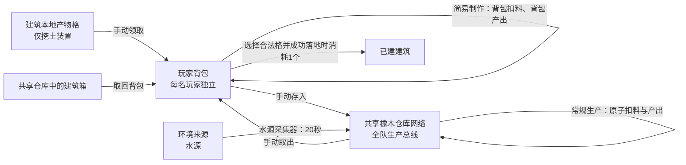
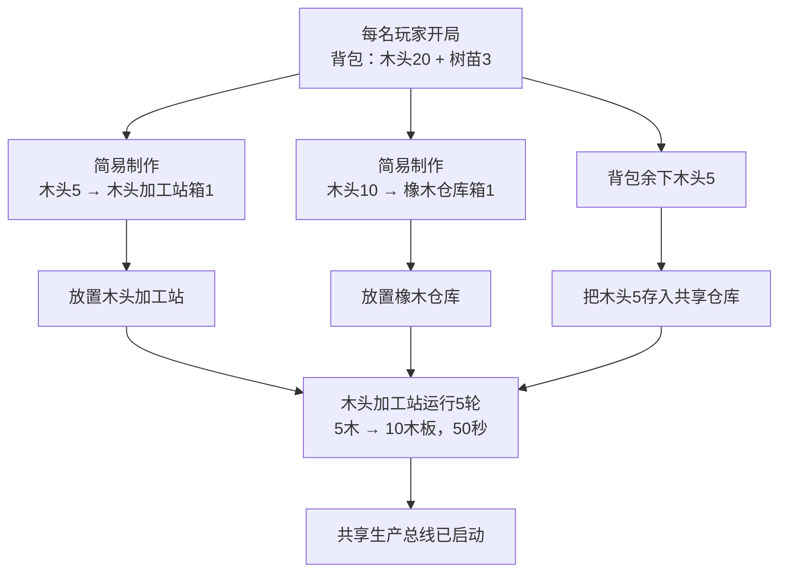
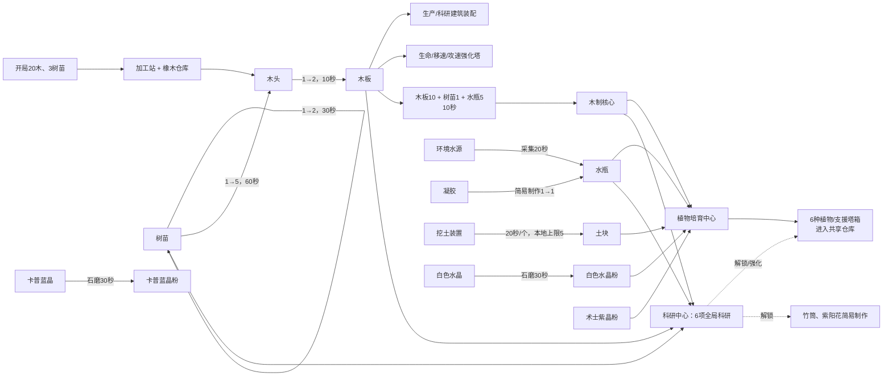
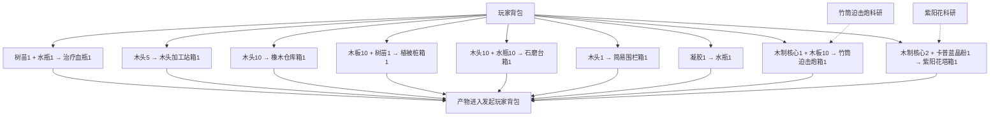
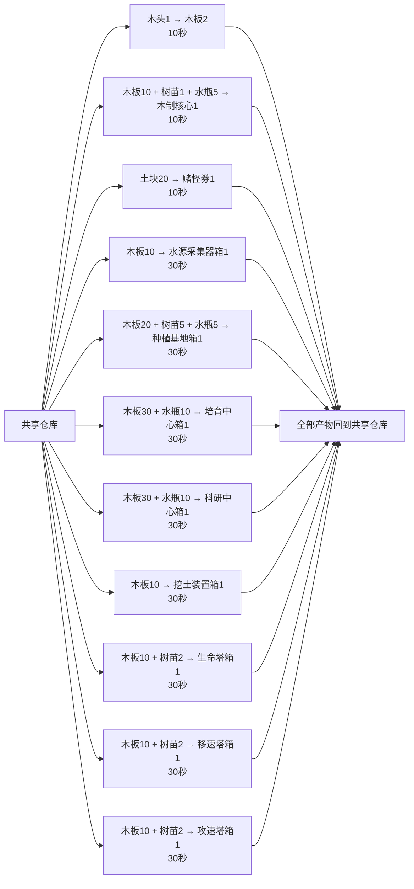
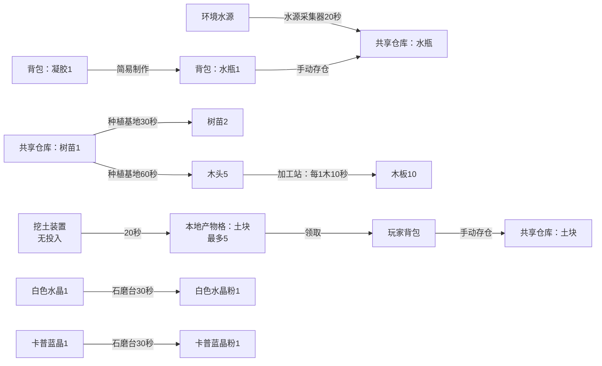
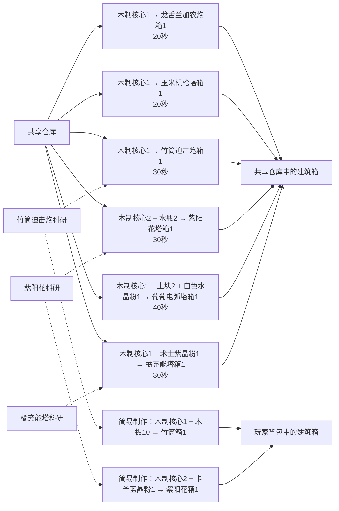
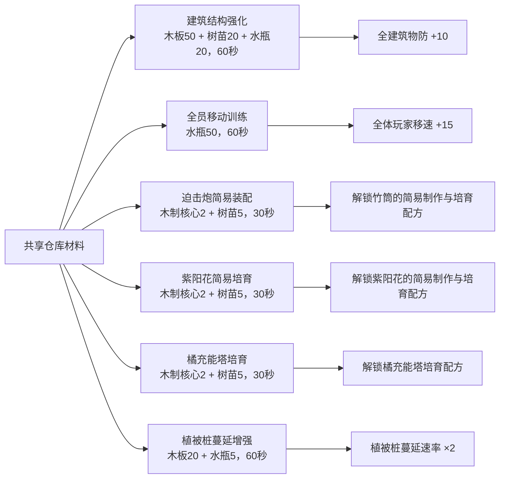
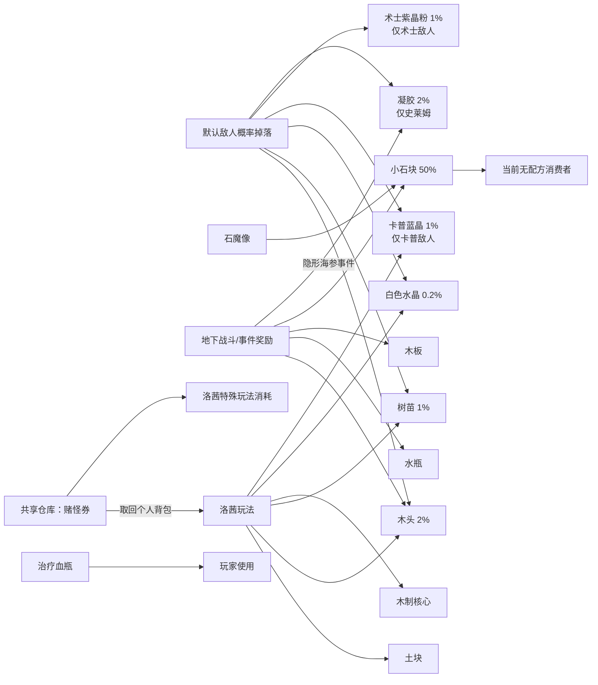

# 塔防模式完整生产与配方流程图

- 审查日期：2026-08-17
- 数据基线：`eb54eb7a`（任务4～6完成后的 `main`）
- 审查范围：正式塔防开局资源、9条简易制作、23条建筑生产配方、6项全局科研，以及配方原料的外部来源和最终去向
- 口径：本报告以运行时 `.tres`、注册表和生产建筑场景为准；测试场、性能战役和内部环境伪物料不计入玩家配方

## 1. 审查结论

当前正式生产链共有 **32条配方**：9条简易制作和23条建筑生产配方。另有6项全局科研。

关键结论：

1. 每名玩家开局获得背包内木头20、树苗3；多人模式为每名已注册玩家分别发放。
2. 确定性起步路线已经闭合：20木可制作木头加工站（5木）和橡木仓库（10木），余下5木入仓后可加工为10木板。
3. 简易制作只读写发起玩家背包；除环境输入与挖土装置本地产物格外，常规生产只读写共享仓库。
4. 木头加工站与植物培育中心产出的建筑箱均进入共享仓库。取出到背包后才能发起建造；建筑箱在背包和仓库内均可堆叠至999。
5. 挖土装置是唯一使用本地产物格的配方：容量5，领取到玩家背包后才可再存入共享仓库。
6. 共享仓库并不包含玩家背包。常规生产始终只从共享仓库取料；没有已落地且可工作的橡木仓库时，既无共享投入来源，也无共享产物落点。

## 2. 三种物品域与结算边界

结算规则分为三类：简易制作在缺料或背包容量不足时整笔拒绝，不扣除任何投入；共享生产在启动与结算前原子预检，缺料或仓库满时暂停等待；挖土装置的本地产物格满5后暂停，背包容量不足只会阻止领取，已经产出的土块仍保留在装置中。

## 3. 开局到首条生产线

树苗3仍在个人背包；需要参与共享生产时必须手动存仓。加工站投产约50秒后可获得10木板（不含约0.7秒的建筑落地效果），可优先用于水源采集器、挖土装置、支援塔或继续积累仓储生产能力。

## 4. 完整发展主干

## 5. 分支流程图

### 5.1 玩家背包内的9条简易制作

所有简易制作的配置时长均为0.1秒，运行时按即时原子事务结算；科研门槛仍会在事务前校验。

### 5.2 木头加工站：材料与建筑装配

### 5.3 可再生资源、水与矿物

树苗增殖和树苗转木头构成可再生木材闭环；水源采集器构成无耗材水循环。凝胶制水是个人背包内的替代路线。

### 5.4 植物培育中心与双获取路线

竹筒迫击炮和紫阳花雨幕塔各有两条获取路线；同一全局科研同时约束其简易制作和培育中心配方。橘充能塔只有培育中心路线。

## 6. 32条配方核对表

域缩写：`背→背`为个人背包原子事务，`仓→仓`为共享仓库原子事务，`环境→仓`为环境输入，`无→本地`为建筑本地产物格。

### 6.1 简易制作（9条）

| # | 配方 ID | 投入 → 产出 | 域 | 时长 | 门槛 |
|---:|---|---|---|---:|---|
| 1 | `herbal_health_potion` | 树苗1 + 水瓶1 → 治疗血瓶1 | 背→背 | 0.1秒 | 无 |
| 2 | `wood_processing_station` | 木头5 → 木头加工站箱1 | 背→背 | 0.1秒 | 无 |
| 3 | `oak_warehouse` | 木头10 → 橡木仓库箱1 | 背→背 | 0.1秒 | 无 |
| 4 | `vegetation_stake` | 木板10 + 树苗1 → 植被桩箱1 | 背→背 | 0.1秒 | 无 |
| 5 | `stone_mill` | 木头10 + 水瓶10 → 石磨台箱1 | 背→背 | 0.1秒 | 无 |
| 6 | `simple_fence` | 木头1 → 简易围栏箱1 | 背→背 | 0.1秒 | 无 |
| 7 | `gel_to_water_bottle` | 凝胶1 → 水瓶1 | 背→背 | 0.1秒 | 无 |
| 8 | `bamboo_mortar` | 木制核心1 + 木板10 → 竹筒迫击炮箱1 | 背→背 | 0.1秒 | `bamboo_mortar_crafting` |
| 9 | `hydrangea_rain_tower` | 木制核心2 + 卡普蓝晶粉1 → 紫阳花雨幕塔箱1 | 背→背 | 0.1秒 | `hydrangea_rain_tower_crafting` |

### 6.2 建筑生产（23条）

| # | 生产者 | 配方 ID | 投入 → 产出 | 域 | 时长/容量 | 门槛 |
|---:|---|---|---|---|---:|---|
| 10 | 木头加工站 | `wood_to_plank` | 木头1 → 木板2 | 仓→仓 | 10秒 | 无 |
| 11 | 木头加工站 | `wooden_core_assembly` | 木板10 + 树苗1 + 水瓶5 → 木制核心1 | 仓→仓 | 10秒 | 无 |
| 12 | 木头加工站 | `gambler_ticket_assembly` | 土块20 → 赌怪专用券1 | 仓→仓 | 10秒 | 无 |
| 13 | 木头加工站 | `water_collector_assembly` | 木板10 → 水源采集器箱1 | 仓→仓 | 30秒 | 无 |
| 14 | 木头加工站 | `planting_base_assembly` | 木板20 + 树苗5 + 水瓶5 → 种植基地箱1 | 仓→仓 | 30秒 | 无 |
| 15 | 木头加工站 | `plant_cultivation_center_assembly` | 木板30 + 水瓶10 → 植物培育中心箱1 | 仓→仓 | 30秒 | 无 |
| 16 | 木头加工站 | `research_center_assembly` | 木板30 + 水瓶10 → 科研中心箱1 | 仓→仓 | 30秒 | 无 |
| 17 | 木头加工站 | `excavator_assembly` | 木板10 → 挖土装置箱1 | 仓→仓 | 30秒 | 无 |
| 18 | 木头加工站 | `wooden_core_to_life_tower` | 木板10 + 树苗2 → 生命强化塔箱1 | 仓→仓 | 30秒 | 无 |
| 19 | 木头加工站 | `wooden_core_to_speed_tower` | 木板10 + 树苗2 → 移速强化塔箱1 | 仓→仓 | 30秒 | 无 |
| 20 | 木头加工站 | `wooden_core_to_attack_speed_tower` | 木板10 + 树苗2 → 攻速强化塔箱1 | 仓→仓 | 30秒 | 无 |
| 21 | 石磨台 | `white_crystal_to_powder` | 白色水晶1 → 白色水晶粉1 | 仓→仓 | 30秒 | 无 |
| 22 | 石磨台 | `capoo_blue_crystal_to_powder` | 卡普蓝晶1 → 卡普蓝晶粉1 | 仓→仓 | 30秒 | 无 |
| 23 | 水源采集器 | `water_to_bottle` | 环境水源 → 水瓶1 | 环境→仓 | 20秒 | 无 |
| 24 | 种植基地 | `sapling_propagation` | 树苗1 → 树苗2 | 仓→仓 | 30秒 | 无 |
| 25 | 种植基地 | `sapling_to_wood` | 树苗1 → 木头5 | 仓→仓 | 60秒 | 无 |
| 26 | 植物培育中心 | `wooden_core_to_agave_cannon` | 木制核心1 → 龙舌兰加农炮箱1 | 仓→仓 | 20秒 | 无 |
| 27 | 植物培育中心 | `wooden_core_to_corn_machine_gun` | 木制核心1 → 玉米机枪塔箱1 | 仓→仓 | 20秒 | 无 |
| 28 | 植物培育中心 | `wooden_core_to_bamboo_mortar` | 木制核心1 → 竹筒迫击炮箱1 | 仓→仓 | 30秒 | `bamboo_mortar_crafting` |
| 29 | 植物培育中心 | `wooden_core_to_hydrangea_rain_tower` | 木制核心2 + 水瓶2 → 紫阳花雨幕塔箱1 | 仓→仓 | 30秒 | `hydrangea_rain_tower_crafting` |
| 30 | 植物培育中心 | `wooden_core_to_grape_arc_tower` | 木制核心1 + 土块2 + 白色水晶粉1 → 葡萄电弧塔箱1 | 仓→仓 | 40秒 | 无 |
| 31 | 植物培育中心 | `wooden_core_to_orange_charging_tower` | 木制核心1 + 术士紫晶粉1 → 橘充能塔箱1 | 仓→仓 | 30秒 | `orange_charging_tower_crafting` |
| 32 | 挖土装置 | `excavator_cycle` | 无投入 → 土块1 | 无→本地 | 20秒；上限5 | 无 |

注意：`wooden_core_to_life_tower`、`wooden_core_to_speed_tower`、`wooden_core_to_attack_speed_tower` 的稳定 ID 含 `wooden_core`，但实际投入是木板和树苗。该差异是命名债务，不代表配方消耗木制核心。

## 7. 6项全局科研

所有科研都从共享仓库提交材料，完成后对本局全队生效。

| 科研 ID | 投入 | 时长 | 运行时结果 |
|---|---|---:|---|
| `building_defense` | 木板50 + 树苗20 + 水瓶20 | 60秒 | 全建筑物理防御 +10 |
| `player_move_speed` | 水瓶50 | 60秒 | 全体玩家移动速度 +15 |
| `bamboo_mortar_crafting` | 木制核心2 + 树苗5 | 30秒 | 解锁竹筒迫击炮两条配方 |
| `hydrangea_rain_tower_crafting` | 木制核心2 + 树苗5 | 30秒 | 解锁紫阳花雨幕塔两条配方 |
| `orange_charging_tower_crafting` | 木制核心2 + 树苗5 | 30秒 | 解锁橘充能塔培育配方 |
| `vegetation_stake_spread_enhancement` | 木板20 + 水瓶5 | 60秒 | 植被桩蔓延速率 ×2 |

## 8. 外部原料来源与终端

默认敌人掉落是概率外源，不应纳入确定性起步预算。小石块目前没有配方消费者，是明确的终端/未来扩展物料。

## 9. 供审查的阻塞点

| 阻塞点 | 当前行为 | 审查问题 |
|---|---|---|
| 尚未建橡木仓库 | 常规生产无法读背包，也没有共享产物落点 | 20木起步已保证可同时建加工站与仓库 |
| 仓库已满 | 共享产物配方停在完成点等待腾位 | 是否需要仓库满提示或自动扩容引导 |
| 挖土装置本地格满5 | 停止下一轮，必须领取 | 是否需要跨装置统一领取提示 |
| 建筑箱仍在共享仓库 | T目录只统计玩家拥有的背包数量 | 是否需要“一键取出并建造”交互 |
| 竹筒/紫阳花双路线 | 同一科研解锁两条成本不同的路线 | 两条路线的成本差异是否符合预期 |
| 三个强化塔配方 ID | ID写“wooden_core”，实际不耗木制核心 | 是否安排带存档/快照迁移的统一重命名 |
| 小石块 | 有外部来源但无消费者 | 保留为未来物料，还是补充生产用途 |

## 10. 权威数据位置

- 开局背包：`run_state.gd`、`resources/config/campaigns/tower_defense/formal_progression.tres`
- 配方字段契约：`resources/config/production/production_recipe.gd`
- 简易制作注册：`resources/config/production/simple_crafting_registry.gd`
- 建筑物品与主要获取路线：`resources/config/buildings/building_item_registry.gd`
- 全局科研注册：`resources/config/research/global_research_registry.gd`
- 生产建筑配方挂载：`scene/plant_defense/wood_processing_station.tscn`、`stone_mill.tscn`、`water_collector.tscn`、`planting_base.tscn`、`plant_cultivation_center.tscn`、`excavator.tscn`
- 共享仓库原子事务：`scene/game_modes/tower_defense/economy/production/production_coordinator.gd`
- 正式敌人掉落：`resources/config/enemies/default_enemy_drop_table.tres`、`stone_golem_drop_table.tres`
